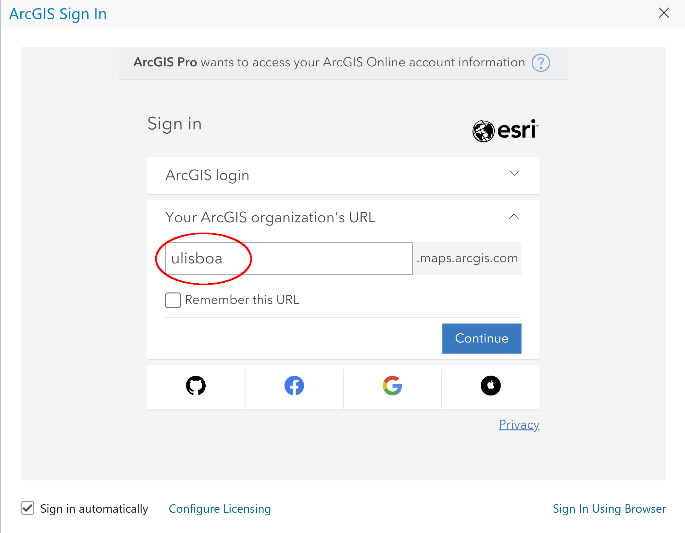

# Geographic Information Systems 2022-2023

# Exercise 1 - ArcGIS Pro  - Install and get familiar with the interface

## Introduction

In this exercise, you will set up your system to have a fully functional ArcGIS Pro ver. 2.9 installation.
You will also learn to identify the different components of the interface of the software and the workflow 
to manage data and perform analysis.

## 1. Install ArcGIS Pro ver 2.9

ArcGIS Pro is a proprietary software. In order to use it, you need to use a licence provided by ISA. This 
exercise will guide you through the several steps to install and set the licence.

The **System Requirements** are available at [https://pro.arcgis.com/en/pro-app/2.9/get-started/arcgis-pro-system-requirements.htm](https://pro.arcgis.com/en/pro-app/2.9/get-started/arcgis-pro-system-requirements.htm). If your system operating system is a MacOS ou linux, you need to install a virtual machine with Windows 8.1 or above.

You can download the installation file from ISA CIISA service. In order to do this, your computer needs to be connected inside the ISA campus network (wifi eduroam). If you are outside the ISA network, you need establish a VPN connection (see instructions here: [https://www.isa.ulisboa.pt/di/servicos/acesso-vpn](https://www.isa.ulisboa.pt/di/servicos/acesso-vpn))

### **Step 1: Access the software repository @ISA**

Open a run panel in Windows with the following key combination: Windows key + R
Write the network path to the text box:
```
\\CIISAfs.isa.utl.loc\Apps\ESRI
```

Enter  your ISA login credentials, in the format:

username: `SIISA\isa1*****`

password: `*******`

### **Step 2: Copy installation and patch files to your computer**

Copy from the network folder `ArcGIS_Pro` the installation package file `ArcGISPro_29_179927.exe`, and the patch files `ArcGIS_Pro_291_179945.msp`, `ArcGIS_Pro_295_181689.msp` and `ArcGIS_Pro_296_184282.msp` to your computer

### **Step 3: Run installation and patch files to your computer**
Run the three downloaded files, in the order of above, accepting the default options (first ArcGISPro_29_179927.exe, secondly ArcGIS_Pro_291_179945.msp, ...) 

*Note:* we will not use in this course the latest version of ArcGIS Pro (ver 3.0.3). The reason is to ensure we are using a consolidated, bug-free version. You can, however, use it at your own risk.

### **Step 4: Configure the licence**

Run ArcGIS Pro for the first time and activate the licence. 

- Click 
***Configure licensing***:


- Select **Concurrent license**, insert the name of license manager  `tobamovirus.isa.utl.loc` and click **Refresh**, then check all the available boxes (see image below), to conclude click **OK**.



### **Step 5: Authorize off-campus use**

If you need to use ArcGIS Pro outside the ISA campus, you must (still inside the ISA campus, or being connected through the ISA vpn) launch ArcGIS Pro, click on Settings (down left corner on the first ArcGIS Pro window), select Licencing (on the left banner) and check the “Authorize ArcGIS Pro to work offline Number of days: 180” box (and wait a few minutes to borrow the licences into your pc). Leave this Settings window by clicking  the upper left corner arrow.

### **Step 6 (Optional):  Create a free ArcGIS Online**

You can rreate a free ArcGIS Online Public account. This gives access to a large catalog of online data.
Go to [https://tinyurl.com/rfmm6nnn](https://tinyurl.com/rfmm6nnn) and provide the required information to register. 

Confirm the new account in your email to activate it.
When opening ArcGIS Pro, click on **Sign In** to login.

Do not forget to sign out, when closing the application, particularly if you are using a classroom or shared computer.

## 2. Get familiar with ArcGIS Pro 2.9 (tutorial)

### 2.1. Learn about the ArcGIS Pro interface

- Create a new project from a blank map template. Understand the interface, including menus (tabs), tools ribbon, view pane, contents pane, catalog pane, table pane.

- Verify that tabs, ribbon and panes are changed dynamically, depending on the tools and views selected.
Learn how to reset panes to the original configuration

Support material: [https://pro.arcgis.com/en/pro-app/2.9/get-started/introducing-arcgis-pro.htm](https://pro.arcgis.com/en/pro-app/2.9/get-started/introducing-arcgis-pro.htm)


### 2.2. Create a map and add data

- Learn how to create a new project, a new map, and add data to the map.

- Understand the concepts and differences between projects, maps, (geo)databases, geopackages, data and features

Support material:

- [https://pro.arcgis.com/en/pro-app/2.9/get-started/create-a-project.htm](https://pro.arcgis.com/en/pro-app/2.9/get-started/create-a-project.htm)

- [https://pro.arcgis.com/en/pro-app/2.9/get-started/add-data-to-your-project.htm](https://pro.arcgis.com/en/pro-app/2.9/get-started/add-data-to-your-project.htm)

### 2.3. Other resources

ArcGIS Pro manual: [https://pro.arcgis.com/en/pro-app/2.9/get-started/get-started.htm](https://pro.arcgis.com/en/pro-app/2.9/get-started/get-started.htm)

Other tutorials: [https://pro.arcgis.com/en/pro-app/2.9/get-started/pro-quickstart-tutorials.htm](https://pro.arcgis.com/en/pro-app/2.9/get-started/pro-quickstart-tutorials.htm)


### 2.4. Understand geodatabases 

**Geodatabases** are a collection of geographic datasets. They contain a series of tables to hold feature classes, raster datasets, attributes.

Data in geodatabases can be stored in database management systems (DBMS) or in the file system. ArcGIS supports different formats:

- **GeoPackage** - an open, standards-based, platform-independent, portable, self-describing, compact format for transferring geospatial information
- **File geodatabase** - ESRI proprietary format, file bases
**Personal geodatabase** - ESRI proprietary format, uses MS Access format
- **Enterprise geodatabase** - data is stored inside a database (IBM Db2, IBM Informix, Microsoft SQL Server, Oracle, PostgreSQL)

The use of geodatabases allow improved performance and consistency in the use of data. But its management should be done within the GIS software, to ensure consistency. Do not manage these files (copy, delete, duplicate, etc) with your file browser.

In ArcGIS Pro, the native (best supported) format for geodatabases are **File geodatabase**, **Personal geodatabase** and **Enterprise geodatabase**. We should use file geodatabases for our projects.

To ensure interoperability and future data preservation, final data outputs or layers to preserve should be stored in the standard geodatabase format **GeoPackage**.

