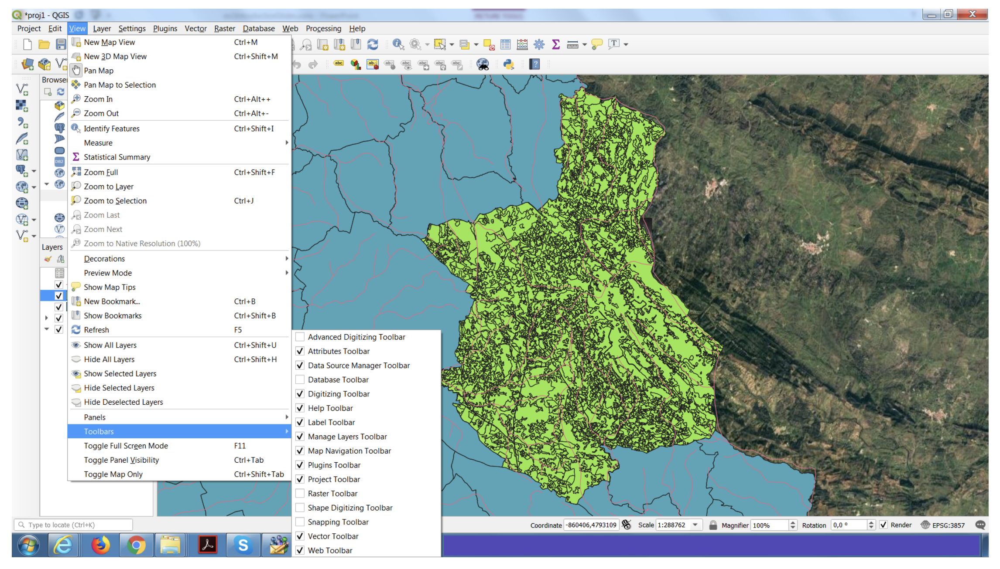
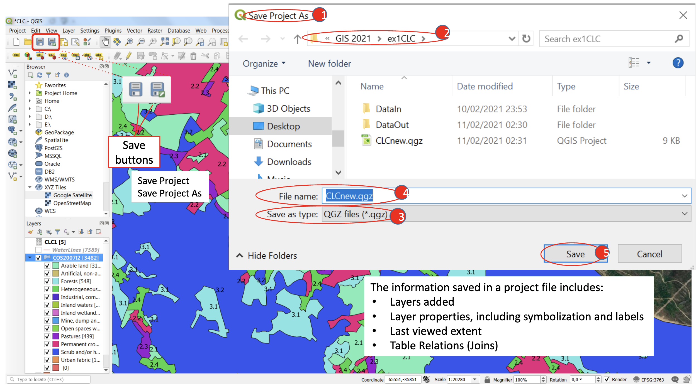

# Geographic Information Systems 2022-2023

# Exercise 2 - QGIS  - Explore your first QGIS project

## Introduction

In this exercise, you will have an overview of very basic and generic QGIS functions of QGIS interface.
You will also learn to identify the different components of the interface of the software and the workflow 
to manage data and perform analysis.


## 1. Download and open a QGIS project

To prepare your environment for this first exercise using QGIS, do the following:

- Create a working folder named GIS_ex01

- Download from Fenix (menu Exercises -> QGIS) the file Ex1CLC.zip for the Exercise 01 to your folder GIS

- Unzip the file Ex1CLC.zip into your folder GIS. This should create a new folder containing a QGIS project 
file `CLC.qgz` and a folder `DataIn` containing 3 geographic data sets (files `COS2007l2.gpkg`, 
`Portalegre.gpkg`, `Waterlines.gpkg`. The file format is gpkg, meaning GeoPackage file format.

- Create a folder named DataOut in the same folder where already is the folder DataIn

- launch the QGIS project by double-clicking on the file `CLC.qgz`. This should open a new window of QGIS.


## 2. Get familiar with QGIS 3.22 Interface

### 2.1. Interface - Terminology

The default interface of QGIS is composed by:
- main menu
- standard toolbar
- main visualization panel
- browser panel - access to data sources
- Layer panel - list of data layers added to the project 
- Processing toolbox - right panel with tools


### 2.2. Interface - Customise

All panels can be rearranged in the window, and resized. Other panels and toobars can be added. Right-click 
on a empty area of the toolbar to display a list of available **Panels** and **Toolbars**, and activate 
or deactivate their display.

In alternative, you can activate/deactivate through the menu *View → Panel* or *View → Toolbar* 



### 2.3. Interface - reset to the original configuration

Sometimes, it is convenient to reset the QGIS interface to the original default settings. You can do this 
by going to the menu Settings → System and select *Reset user interface to default settings (restart required)*.

### 2.4. Change basemap

Change the base map of your view panel, to a tiled service layer. On the Browse panel, add a new 
connection to XYZ Tyles (see image), with the value 
```
https://www.google.cn/maps/vt?lyrs=s@189&gl=cn&x={x}&y={y}&z={z}
```


### 2.5. Zooming and panning

Explore the Zoom and Pane toolbar buttons to navigate and see different detail levels of your spatial data


### 2.6. Identify project and layer metric units

Identify the current project reference system in the bottom right side of the status bar, in the 
bottom-right corner of your window. Click on the projection to obtain more details about the 
*coordinate reference system* of the QGIS project. This will tell also if the coordinate system as 
geographic or metric coordinates. 


To obtain the same information for a layer, you will right-click on the layer name (in the Layers 
panel), and select `Properties` from the context menu. Then, select `Source`.

### 2.7. The Identify Features tool

The Identify tool allows to click on a specific feature, to see the associated attributes.


### 2.8. The Select Features tool

The Select tools allows to select one or more features, on which you can do subsequent operations. 
Note the *Deselect features* button.


### 2.9. Context menus

The context menu displays a maenu with different options, specific for the item on which it was activated.


### 2.10. Create a legend/key

You can create a legend based on the attribute data of a layer. Follow the steps in the image to 
create a legend for the layer `COS200712`.


Repeat the procedure on the same layer, but select a numeric attribute.


### 2.11. Add labels to the spatial features

You can create add labels to the features based on the attribute data of a layer. Follow the 
steps in the image add labels to the layer `COS200712`.


### 2.12. Save or Save as

You can save all the changes you made to your project (legend, labels, visible layers and order, etc.). 
Please note that the files of the geographic layers are not saved inside the project file. Instead, 
what the project saves is the relative path to the storage location of the geographic files in your disk.

For this reason, it is very important to save the project with the final location of the files, and 
not to move them, or change the name of the folder where these are stored, after closing the project.

The ideal structure of a QGIS project should be, for the present example:

```
Project item                Description

ex1CLC                      (project folder)
│   CLC.qgz                 (project file)
│
└───DataIn (folder)         (subfolder)
│   │   CLC1.xls            (data file)
│   │   COS200712.gpkg      (data file, geopackage)
│   │   Portalegre.gpkg     (data file, geopackage)
│   │   Waterlines.gpkg     (data file, geopackage)
│   │   ...
│   
└───DataOut (folder)
    │   ...
```

You can also save the project with a new name:


