# Geographic Information Systems 2023-2024

# Exercise 3 - QGIS  - Perform you first analysis with QGIS 3.28

## Introduction

The goals of these exercise are:

- To create a geographic data set (gds), in a folder named DataOut, representing 
locations from the gds COS2007l2 that simultaneously verify the following requirements:

>    - have a water stream within a distance less than or equal to 1 km
>    - have a 1st level of the CLC (Corine Land Cover project) classification as 
>    “Agricultural areas” or “Forest and semi natural areas”

 - To calculate:

>    - The areas of “Agriculture” or “Forest and semi natural areas”, in ha
>    - The areas per administrative region "freguesia" of “Agriculture” or 
“Forest and semi natural areas”, in ha.

You will be guided through the exercise with visuals representing the actions 
to take.

**What do you need:**

For this exercise, you should use the same project as saved in the final of the exercise 02.
It includes:

- the input data for the exercise 02, also available from Fenix → SIGeo → 
Exercises → ArcGIS Pro → [ex1CLC.zip](https://fenix.isa.ulisboa.pt/downloadFile/844497944593813/ex1CLC.zip). It contains three spatial layers, and a csv table:
>    - gds COS2007l2 (geometry: polygons) – land coverage according to the 2nd 
    level classification of the project CORINE Land Cover
>    - gds WaterLines (geometry: lines) – waterlines (rivers but not only)
>    - gds Portalegre (geometry: polygons) – administrative boundaries (freguesias)
>    - table CLC1 (table) – the 1st level classification of the project CORINE Land Cover

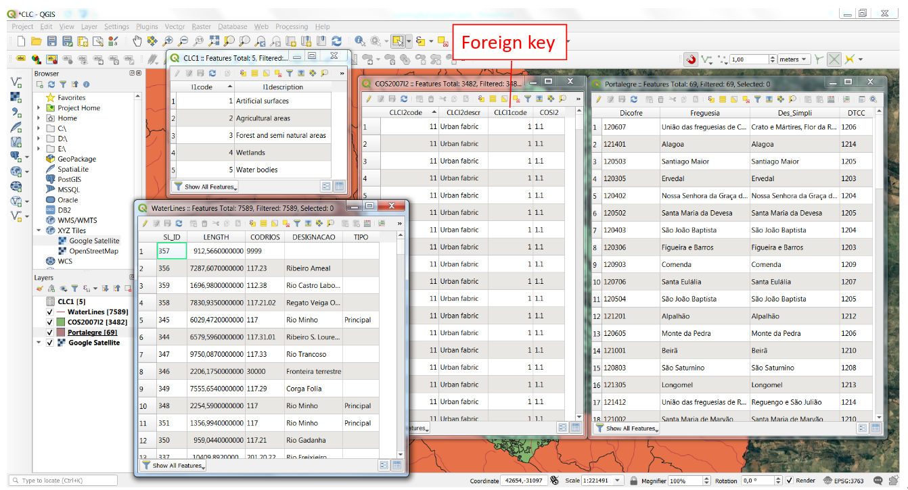

**Expected output**

You should prepare your environment to save the output layers, using the Catalog Pane:
> - create a folder under “DataOut”
> - create a new geopackage inside the new folder named "ex03_out.gpkg”. This geopackage 
will store new layers. Details on how to create the geopackage later in the exercise.


**Requirements**

> You will use QGIS 3.28 to perform this exercise. You should have performed before
Exercise 02, about the introduction to QGIS interface.

> You should also be able to use QGIS documentation to, search, learn and solve questions 
on how to use the tools. The documentation is available, either from the **Help** 
of the software, or [online](https://docs.qgis.org/3.28/en/docs/user_manual/index.html). 


**Quality control**
> You are required to make quality assessment steps through out the workflow. 
This involves:
> - check the if the results of each spatial operation make sense. 
>      - this may require additional calculations by hand, for example, to 
cross-check area values in square meters with hectares
>      - spatial operations may results in outdated data in the attribute tables 
of the outputted gds. This requires review, clean and update these tables
> - ensure that data inputs and data outputs are correctly managed
>     - imported datasets do not contain errors (in the attribute values)
>     - file names are correctly spelled and file location is the expected (cross-check 
using the file explorer of your system)
>     - the project is frequently saved, and can be closed and open without issues

<br>
<br>

## Task 1 - Create a geographic data set (gds) in a folder named DataOut representing locations from the gds COS2007l2 that simultaneously verify the following requirements:


**A. There is a waterline within a distance less than or equal to 1 km**

**B. The 1st level of the CLC (Corine Land Cover project) classification is 
“Agricultural areas” or “Forest and semi natural areas”**


**One solution:**

### 1. Clip the gds **Waterlines** (7589 lines), in order to reduce these data to the **COS2007l2** polygon layer (only 62 lines):

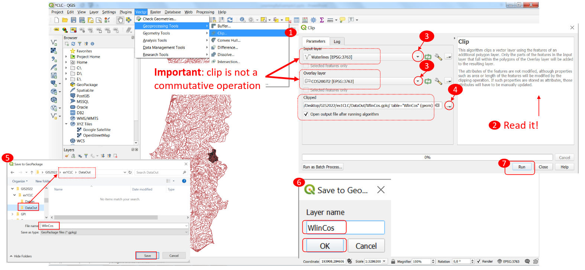

After performing the operation, there are some issues related to not valid or 
outdated data:

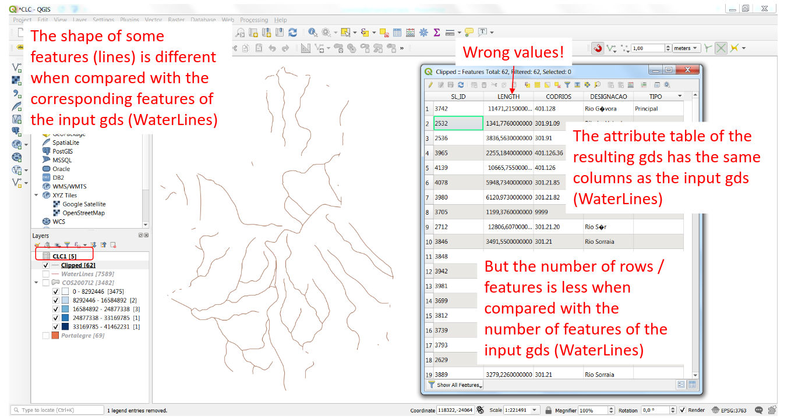
    

To fix the problems:

- Open the attribute table of the gds WlinCos
- Delete the attribute LENGTH of the gds WlinCos
    - Use the Toggle Edit Mode button of the attribute table toolbar
    - Use the Delete field button of the attribute table toolbar ...
    - Use the Toggle Edit Mode button and save the **data updates**
- Create a new attribute of the clipped gds with **data type** *decimal
number (real)*, name it `lengthKm` and fill it with every feature length
(unit Km)
- Use Field Calculator and from the Geometry subset of functions, select `$length`,
to build the expression:
```
$length / 1000
```
- Save the data updates
- Save your QGIS project

This is the visual sequence of operations:

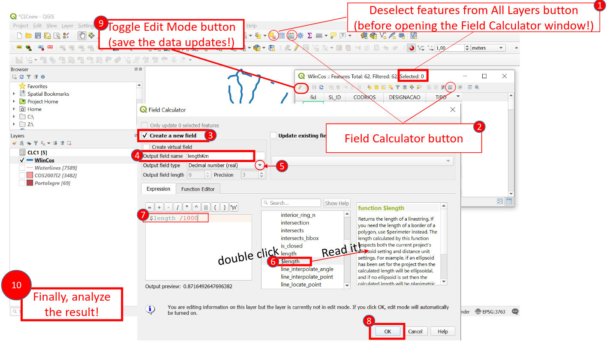

Analyze the results:

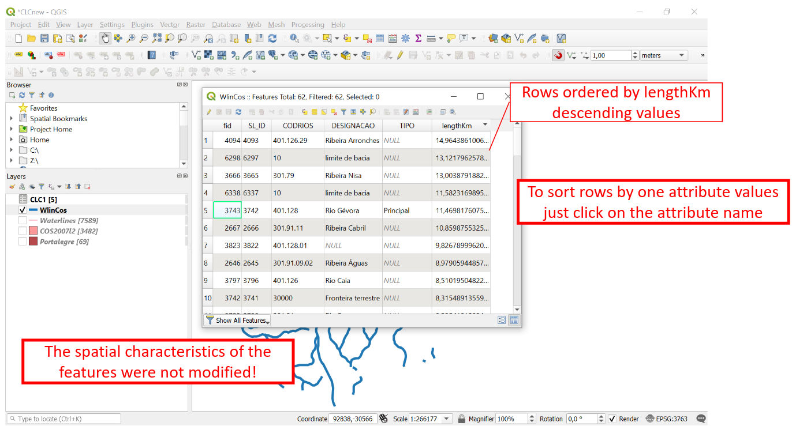

### 2. To find out *regions within a distance less than or equal to 1 km from the clipped waterlines* (layer **WlinCos**)

To do this operation, we will use the **Buffer** spatial operation:

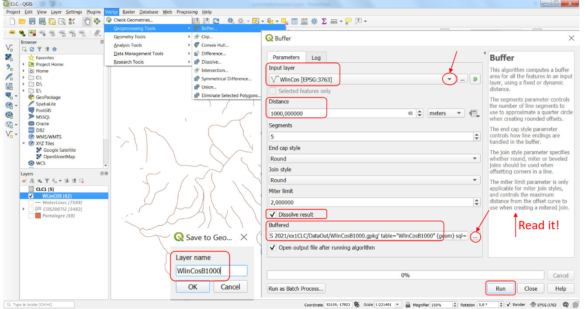

Analyze the results:

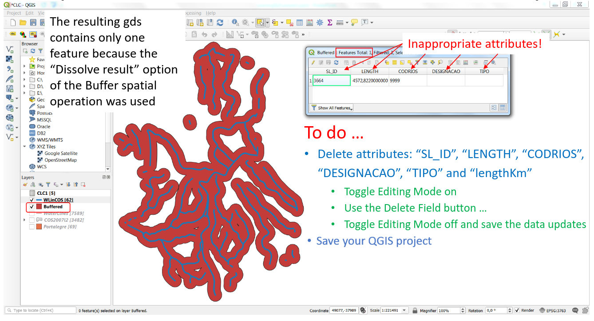

Fix the issues:

- Delete attributes: “SL_ID”, “LENGTH”, “CODRIOS”, “DESIGNACAO”, “TIPO” and “lengthKm”
- Toggle Editing Mode on
- Use the Delete Field button ...
- Toggle Editing Mode off and save the data updates
- Save your QGIS project


### 3. Find the regions from **COS2007l2** that are within a distance less than or equal to 1 km from the clipped waterlines:

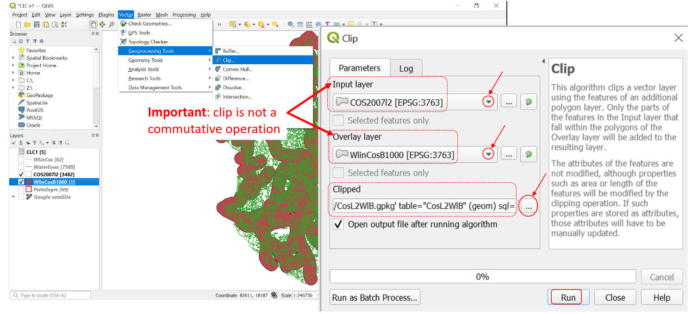

 You need to perform additional verifications or changes:

- Verify if the attributes of gds CosL2WlB must be fixed
- In the gds CosL2WlB, create a new attribute named `areaM2` containing the area 
of each polygon, setting as unit **m2**, and datatype: *Whole number (integer)*
    - Use the tool Field Calculator for this operation
- In the gds CosL2WlB create a new attribute named `areaHa` containing also the 
area of each polygon, setting as unit **ha**, and datatype: real
    - Use the tool Field Calculator and the expression `areaM2 / 10 ^ 4`
- In the gds CosL2WlB create a new attribute named `perimKm` containing the 
perimeter each polygon, setting as unit **km**,« and datatype: real
    - Use the tool Field Calculator fro this operation
- Save your data (gds CosL2WlB) and the QGIS project

### 4. Perform a **join** operation to append the 1st level of the CORINE Land Cover (table **CLC1.csv**) to the **CosL2WlB** layer

Use the **Join** function, available on the Properties panel, opened via context 
menu of the layer:

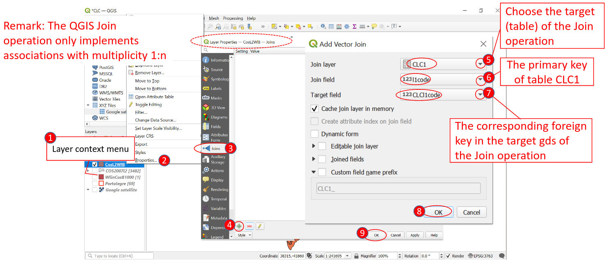

Verify in the attribute table that the fields of the CLC1 table were appended:

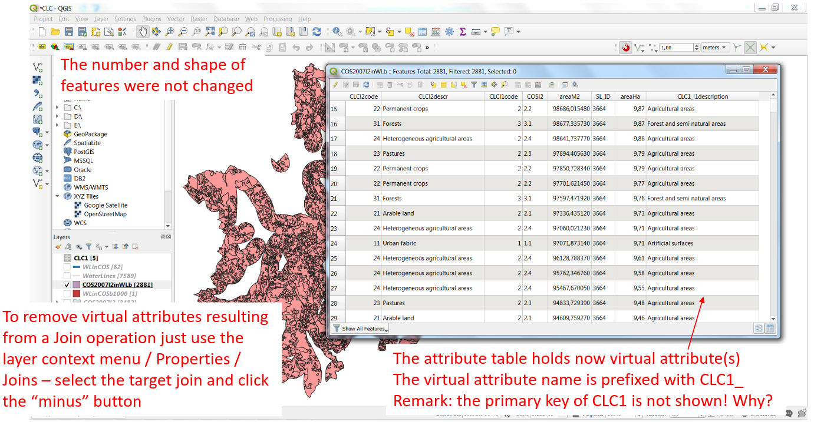

### 5. On layer **CosL2WlB** , select the polygons classified as **“Agricultural areas” or “Forest and semi natural areas”** using the **l1description** attribute

Use the **Select By Expression** tool (available on the Map tab) and logical conditions (logical operators: AND, OR)

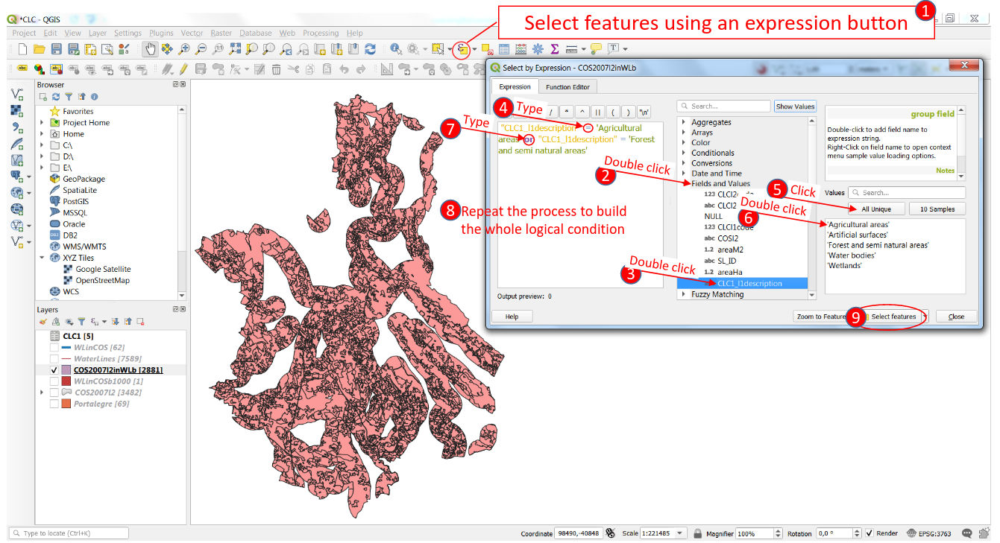

Analyze the results:

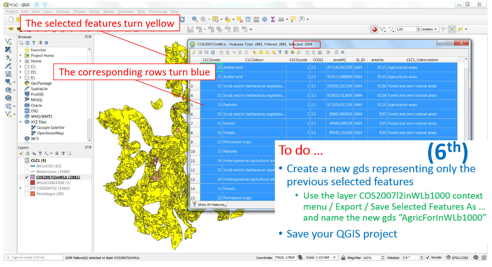

## 6. Save the previously selected polygon as a new gds:

- Use the option fom the the context menu of the layer to save the selection as **AgricForInWlB1000**. Since a selection is active, only the selected features will be included in the export;

- Save your QGIS project.

<br>
<br>

## Task 2 - Calculate:

**A. The areas of “Agriculture” or “Forest and semi natural areas”, in ha**

**B. The areas per administrative region "freguesia" of “Agriculture” or 
“Forest and semi natural areas”, in ha**

**One solution:**

*To answer to question A:*

1. Dissolve the gds **AgricForInWlB1000** in order to create one polygon representing 
    land classified as “agricultural areas” and one polygon representing land 
    classified as “Forest and semi natural areas”. Give to the new gds the name `AgricForDiss`

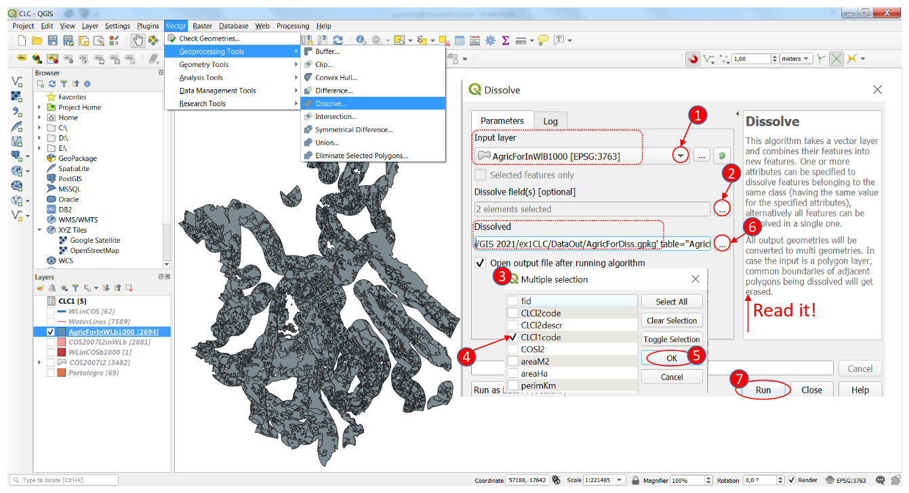

Analyze the results:

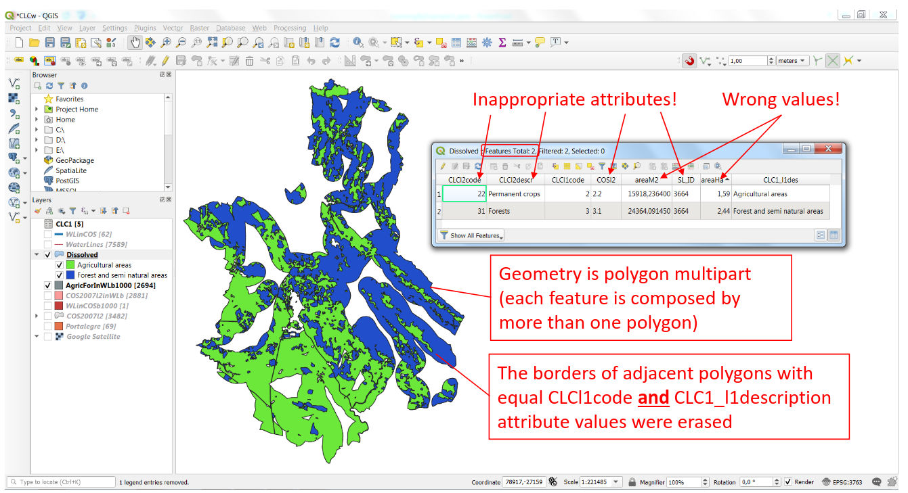

Fix the issues:

- Delete the inappropriate attributes of the new gds **AgricForDiss**
- Update the values of the attributes **areaM2**, **areaHa** and **perimKm** of the new gds **AgricForDiss**
    - Use the Field Calculator only to update the attribute values
- Save the updates to data (gds **AgricForDiss**)
- Save your QGIS project

See the final result:

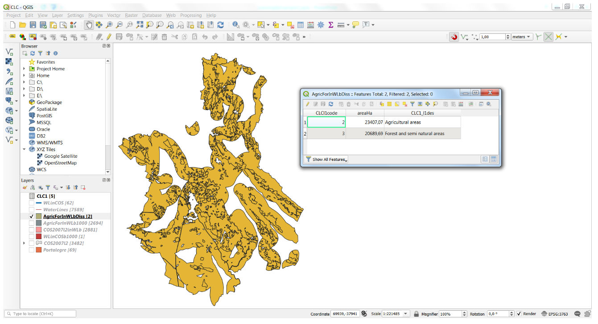


*To answer to question B:*

1. Create polygons by the 1st class of land coverage classification (“agricultural 
areas” or “Forest and semi natural areas”) subdivided by “freguesia”
    - use the **Intersect** spatial operation to intersect **AgricForDiss** 
    with **Portalegre** and create a new gds named `AgricForFreg`

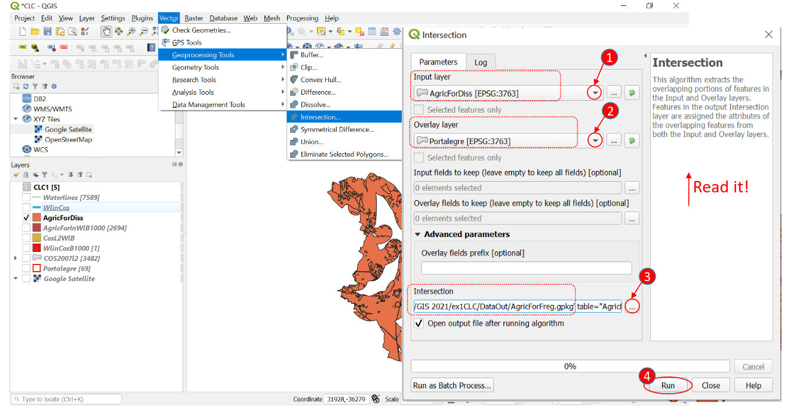

2. Update the **Symbology** to display the combination of land cover and freguesias
        - use the **Expression Dialog** tool to add an expression that results in the 
        following legend:

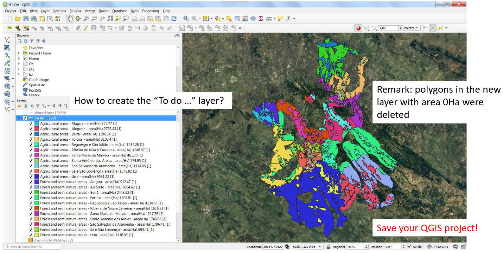
    
3. Update the values of attributes **areaM2**, **areaHa** and **perimKm**

## Task 3 - Describe quality control measures

Describe which quality control measures did you take during the analysis workflow:
- ...
- ...
- ...

...

## Summary and wrap up – Intro do QGIS

This is what you leaned during the first three exercise:

- QGIS support documentation
- Opening a QGIS project
- The QGIS interface
    - Terminology
    - Identify and reset panes
    - Zooming and panning
    - Viewing and hiding toolbars
    - Understand file geodatabases
    - Connecting to Google Satellite Imagery
    - Other buttons of the standard toolbar
        - Open Attribute Table
        - Identify Features
        - Select Features
        - Deselect Features from All Layers
    - Saving a QGIS project
        - Save
        - Save As …
    - Exiting a QGIS project
- Some basic QGIS functions
    - Active Layer Context Menu / Properties / Symbology
        - Single symbol
        - Unique values (categorical legend)
        - Graduate colors (numerical legend)
    - Active Layer Context Menu / Properties / Labels
    - Active Layer Context Menu / Properties / Joins
    - Field Calculator
        - Creating a new attribute filled with values
        - Functions: $length, $area and $perimeter
    - Selecting features using a logical expression (condition)
    - Vector menu / Processing Tools
        - Buffer
        - Clip
        - Dissolve
        - Intersect
- Map legends (categorical and numerical)
- Map labels
- Non-spatial operations
    - Select By Attribute
    - Join of 2 tables (associations 1:n)
- Spatial operations
    - Clip
    - Buffer
    - Dissolve
    - Intersect


