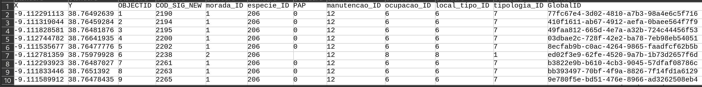
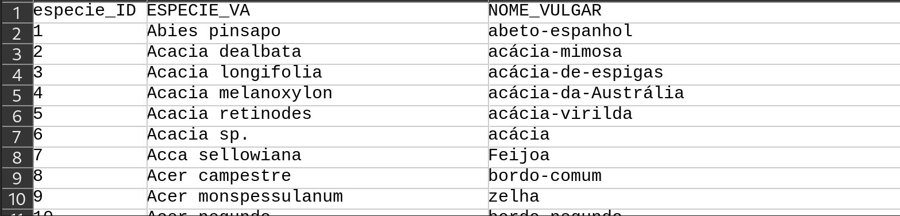
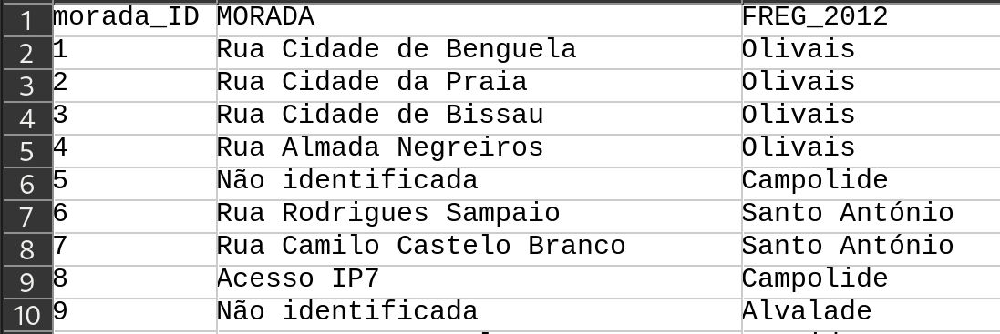
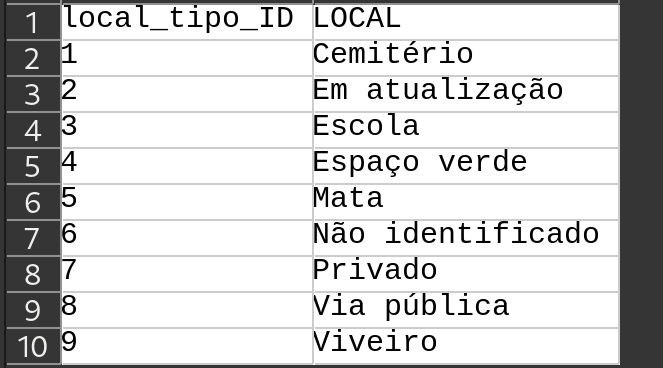
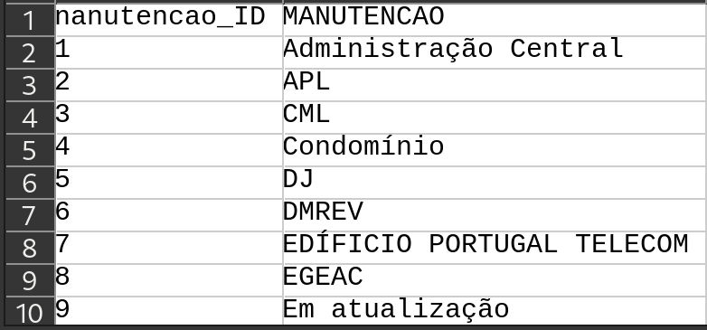
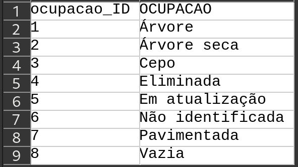
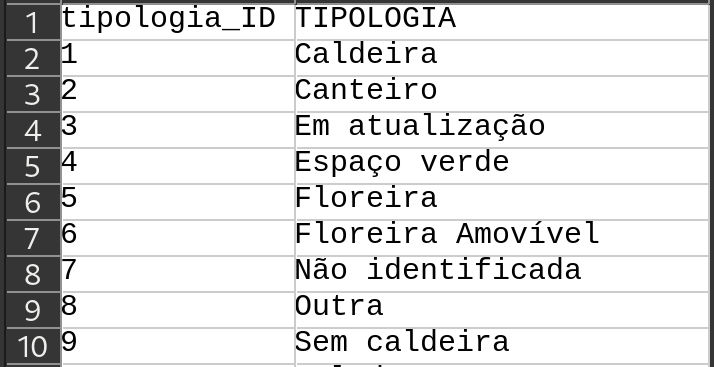

# Geographic Information Systems 2023-2024

# Exercise 4 - Organizing geographic data - Solution

**QUESTION 1:** provide the table schema in text notation for all the tables that 
you identified or created

Double underline: *primary key*
single underline: *foreign key*

> ARVOREDO_NORM(X,Y,OBJECTID,COD_SIG_NEW,<u>morada_ID</u>,<u>especie_ID</u>,PAP,<u>manutencao_ID</u>,<u>ocupacao_ID</u>,<u>local_tipo_ID</u>,<u>tipologia_ID</u>,GlobalID) 
> ESPECIE_VA(especie_ID,ESPECIE_VA,NOME_VULGAR) 
> MORADA(morada_ID,MORADA,FREG_2012) 
> LOCAL_TIPO(local_tipo_ID,LOCAL) 
> MANUTENCAO(manutencao_ID,MANUTENCAO) 
> TIPOLOGIA(tipologia_ID,TIPOLOGIA)

**QUESTION 2:** Include in the report screenshots of the first ten rows of each 
table you created. The names of the columns should be visible and correspond to 
the text schema included in Question 1.

**arvoredo_norm**

**especie_va**

**morada**

**local_tipo**

**manutencao**

**ocupacao**

**tipologia**

**QUESTION 3**: 
How many trees with type of implantation `Canteiro` exists in freguesia `ALCÂNTARA`?
Describe how did you determined it?

There are 133 trees in freguesia *Alcântara* with the implantation of type *canteiro*.

The following steps were follow to achieve the solution:

1. Add all csv tables to GIS project.
2. Table `arvoredo_norm` is added as a text file with point geometry, where `x` are longitudes and `y` latitides.
3. Create table joins between `arvoredo_norm` and each of the tables, setting the primay key and foreign key of each table as defined in question 01 
4. Add `CAOP` layer
5. Make a spatial join operation between `arvoredo_norm` and `CAOP`, to add the name of freguesia to the attribute table of the first table. This is necessary to avoid possible errors in naming of the freguesia in the original table.
6. Make a selection by attribute on the table `arvoredo_norm`, based on the name of freguesia, with the value `ALCÂNTARA`. Determine the number of selected features.