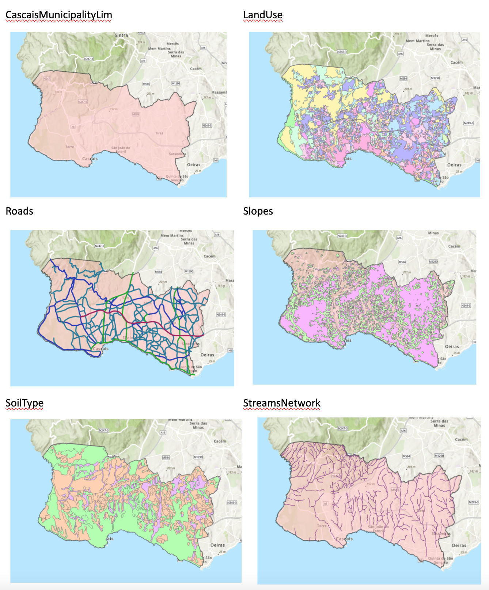

# Geographic Information Systems 2022-2023

# Exercise 5 - Zoning

## Introduction

**Zoning** is a method to divide a geographic area into zones, each of which has a set of regulations for new development, that differs from other zones. This is a powerfull instrument for land use planning and management.

The **Zoning** process involves the application of a set of rules or criteria to divide the land into areas that best fit a specific use. These criteria can be based in a multitude of factors, like type of land cover, type of soil, orography, slope, solar exposition,proximity to natural or artificial features (water streams, roads, coast line, etc.). The use of GIS enables the identification and appplication of rules to identify the  areas of the territory that fullfil the required conditions.

> **GOAL OF THE EXERCISE**
>
> Develop a workflow analysis to identify suitable zones to implement a recreational area

## Source data
Download from Fenix the file [Ex05_Zoning.zip](https://fenix.isa.ulisboa.pt/downloadFile/844497944594811/Ex05_Zoning.zip), which contains the following datasets:

**Geopackages**
- CascaisMunicipalityLim.gpkg - polygon layer with municipality limits
- LandUse.gpkg - polygon layer with land use
- Roads.gpkg - line layer with roads and paths, classified by type
- Slopes.gpkg - polygon layer with slope classification
- SoilType.gpkg - polygon layer with soil type
- StreamsNetwork.gpkg - line layer with water streams classified by type

**Non-spatial tables**
- RoadProtection.csv - table with protection distances to roads, by type of road
- SoilProductivity.csv - classification of soil productivity, by type of soil

**Display of spatial layers**


## Definition of the problem

1. Identify the suitable areas within the municipality of Cascais that fulfills the following requirements:

> **Requirements**
>
> - It cannot be located on **soil with high productivity**; The productivity was determined depending on soil type – the productivity values (low, medium, high) are provided by the table `SoilProductivity`;
> - It cannot be located on **residential areas** (urban, buildings, houses, housing development), **industrial areas** (industrial harbor, sand and stone quarry), **equipment areas** (big equipments, military area) and **coastal areas** (beach and rocky shoreline, sea water and saltpans);
> - It can only be located on land with **slope** between 0% and 5%;
> - It has to be **away from roads** – the distance depends on each road type; these distances (meters) are defined in the table named `roadProtection`;
> - It has to include a **first order water stream**;
> - Its area has to be greater than or equal to **30ha**.

2. Identify the zone with the biggest area over perimeter ratio.

## Preparation of the exercise

- Download input data [Ex05_Zoning.zip](https://fenix.isa.ulisboa.pt/downloadFile/844497944594811/Ex05_Zoning.zip) from Fenix and extract the zip file.
- Create the file sctructure for your project and place input data files inside DataIn folder

The ideal structure of a project folder should be, for the present exercise:

```
Project item                            Description

Ex05                                    (project folder)
│   Ex05.qgz / Ex05.aprx                (QGIS / ArcGIS project file)
│   
|
└───DataIn (folder)                     (subfolder)
│   │   CascaisMunicipalityLim.gpkg     (geopackage)
│   │   LandUse.gpkg                    (geopackage)
│   │   RoadProtection.csv              (table)
│   │   Roads.gpkg                      (geopackage)
│   │   Slopes.gpkg                     (geopackage)
│   │   SoilProductivity.csv            (table)
│   │   SoilType.gpkg                   (geopackage)
│   │   StreamNetwork.gpkg              (geopackage)
│   
└───DataOut (folder)                    (subfolder)
    │   ...
```

## Expected result

The followign areas highlighted in blue were identified as fullfilling all requirements. The highlighted area has the highest area / perimeter ratio.  


