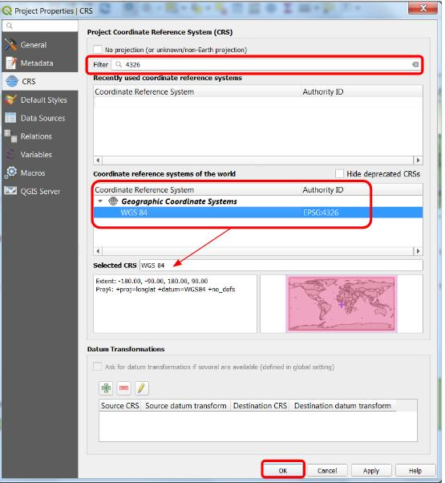
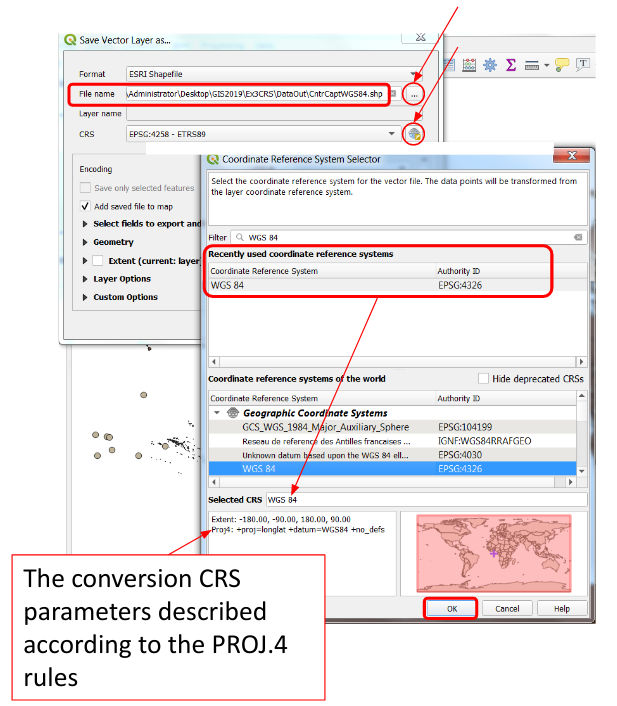

# Geographic Information Systems 2023-2024

# Exercise 6 - Coordinate Reference System - QGIS

## Introduction

> **GOALS OF THE EXERCISE**
>
> - Learn how to identify and define the CRS of a map. 
> - Understand how ArcGIS Pro manages different CRS in the same map
> - Project one gds from one CRS to another CRS
> - Define a new CRS for a gds and solve projection issues 

## Source data
Download from Fenix the file 
[Ex06_CRS.zip](https://fenix.isa.ulisboa.pt/downloadFile/844497944595188/Ex06_CRS.zip), 
which contains the following datasets:
- `CntrCaptETRS89.shp` - point dataset with World Country Capital cities
- `etrs89lcc.shp` - polygon dataset with World countries boundaries
- `GlobalAdmCountriesWGS84.shp` - polygon dataset with World countries boundaries

## 1. Identify and define the CRS of a map. 

1. Create a new QGIS project:
    
    1.1. Create a new project folder

    1.2. Add the DataIn folder of the extracted files to this newly created project folder. 

    1.3. Save the new QGIS project named `ex06` inside the project folder

2. Identify the current CRS of your map
    
    2.1. Select Project menu --> Properties --> CRS. Take note of the CRS, which 
    is default for newly created maps.
    
    2.2. The current CRS of the project can also be verified in the status bar 
    of your QGIS interface, in the right-bottom corner. You can click on it to get more 
    details.
    
3. Add the `CntrCaptETRS89` gds to map
    
    3.1. On the Browser panel, drag it to the Layers panel to add it.
    
    3.2. What is the CRS of the added gds?
    - use the context menu of the layer to see its properties. The information about 
    the CRS is in the Information tab. 
    
    3.3. Check again the map’s CRS. Did it change? Take note of its name. 

4. **Remark**: the map’s CRS always changes to the first added gds CRS!

5. Add the `GlobalAdmCountriesWGS84` gds to the map

    5.1. Take note of the CRS of this layer

    5.2. Check the CRS of the map. Did it change?
    
    5.3. **Remark**: QGIS executed an “On the Fly” transformation (“on the fly” 
    coordinate transformations – OFT) to the project CRS; therefore, presently, 
    visualization is done using EPSG 4258. However, the layers’ CRS didn´t change

6. Save your project.

## 2. Understand how QGIS manages different CRS in the same map

1. Change the project's CRS

    1.1. Use the Project menu --> Properties to change the project's CRS to WGS84 
    (EPSG: 4326) 
    
    1.2. **Remark**: The ETRS89 and WGS84 are both geographic CRS (both use not 
    projected coordinate systems – lat/long in degrees).

    1.3. Would it be appropriate to change this map’s CRS to a projected CRS?

2. Save your project.

## 3. Project one gds from one CRS to another CRS

1. Perform a gds coordinates transformation
    
    1.1. Export the layer `CntrCaptETRS89` as a new gds named `CntrCaptWGS84` 
    (in a new geopackage dataOut file format under a DataOut folder) referenced 
    to the WGS84 CRS (EPSG: 4326)

    

    1.2. **Remark**: WGS84 and ETRS89 presently are datums coincident to within 1 meter.

2. Repeat the operation to create a new layer `CntrCaptWGS84_v2` (in the same 
geopackage location), but using the tool **Reproject Layer**

3. It is not important to save the project now. Why?

## 4. Define a new CRS for a gds and solve projection issues

1. Add labels to the `CntrCaptWGS84` layer to visualize the NAME_ASCI attribute 
values (use the green color).

2. Add labels to the `GlobalAdmCountriesWGS84` layer to visualize the FIRST_NAME 
attribute values (use the black color).

3. Zoom in to your country region. Is the capital wrongly located?

4. Add the `etrs89lcc` gds to the project.

5. Zoom to the `etrs89lcc` layer.

    5.1. Hint: use the layer context menu.

6. Is the result satisfactory? Why? What is the problem?

7. Save the project

8. By default QGIS assigns the default project CRS to gds without CRS

    8.1. Check the current CRS of the layer `etrs89lcc`

9. Actually, the `etrs89lcc` gds coordinates are referenced to the ETRS89 + Lambert 
Conic Conformal projection CRS – ETRS89 / LCC Europe (EPSG: 3034)

10. To fix this problem, define the projection of the layer `etrs89lcc`

    10.1. Use the layer context menu --> Properties --> Source

    10.2. Select the layer and define the CRS (note: check the correct CRS through 
    its EPSG ID)

11. Refresh and check is the layer is correctly projected

12. Save the project

## 5. Calculate point feature coordinates in different CRS

1. Create a new gds from the `CntrCaptWGS84`, containing only the following 
capitals: Lisbon, Madrid, Berlin and Amsterdam; this new gds must be referenced 
to the ETRS89 / LAEA Europe CRS (EPSG: 3035); name this new gds `Europe4CaptETR89LAEA`

    1.1. LEAE = Lambert Azimuthal Equal Area projection.

    1.2. The LEAE projection is appropriate to represent the whole EU and units are meters.

    1.3. It is possible to convert the `GlobalAdmCountriesWGS84` gds to the EPSG 3035 but the result is not satisfactory – try it later on …

2. Use the Vector menu --> Geometry tools --> Add Geometry Attributes... to create a new temporary layer to calculate new attributes containing the latitude and longitude for the 4 capitals mentioned above, referenced to the EPSG 3035

    2.1. Analyze the result, comparing to the LAT and LONG original values
    
    2.2. **Remark!** Temporary layers are lost after closing the QGIS project
    
    2.3. To permanently save a temporary layer and enter the file format, folder and name for the new gds

3. Save the project

## 6. Calculate distances

1. Turn off all project layers except the `Europe4CaptETRS89LAEA` layer

2. Zoom to this layer extent

3. In order to calculate the distances between the 4 capitals, use the Vector menu --> Analysis Tools --> Distance Matrix …

    3.1. As input point layer choose `Europe4CaptETRS89LAEA`.

    3.2. As Input unique ID field choose NAME_ASCI.

    3.3. As Target point layer and Target unique ID field repeat the choices.

    3.4. As Output matrix type choose Linear distance matrix.

    3.5. Save the output as DistMatrix (file type .csv) in your working folder.
    
    3.6. Calculate the Euclidean distance between Lisbon and Madrid (for instance, using Excel) based on the ETRS89/LAEA Europe coordinates (latitude and longitude) determined previously.

4. Analyze the result

5. Save the project

7. From the original, `CntrCaptETRS89`, export a new layer named `EuropeanCaptETRS89`, with only Lisbon, Madrid, Berlin and Amsterdam selected. 

8. Calculate distances in this layer, over the ellipsoid GRS 1980 (the ETRS89 ellipsoid):

    8.1. Lisbon-Madrid: 504,327.702m

    8.2. Lisbon-Berlin: 2,309,476.737m

9. Euclidean distances (on the map), from `Europe4CaptETRS89LAEA`:

    9.1. Lisbon-Madrid: 501,691.748m

    9.2. Lisbon-Berlin: 2,300,384.469m

10. Differences:

    10.1. Lisbon-Madrid: 2,635.955m

    10.2. Lisbon-Berlin: 9,092.268m

11. Were these differences expected?

12. Save the project

## 7. Ad-hoc measurements using QGIS

1. Set the CRS project to WGS 84 (not projected)

    1.1. …the reason being that the gds in this project are global

2. In the Toolbar, open the Measure Line tool (the button is a ruler)

    2.1. On the layer EuropeanCaptETRS89, measure distance between capitals 

    2.2. Note that: 
    - planar measurements are not available
    - the distance link shows a curve shape

3. Why will the measurements be referenced to the WGS84 ellipsoid?

4. Zoom in to your country region and measure the distance between some pairs of capitals (units may be changed …).

5. Explore the Measure tool. Click on the starting and ending points of the segment to be measured

    5.1. Right-click to end a measurement

    5.2. Do composed measurements based on several 
    segments, for example, over a main road of the background image

6. The Measure Line / Area / Angle tool results often are imprecise …

    6.1. It is suitable only to obtain ad-hoc measurements

7. Zoom in to a small region close to the parallel 55º and use the **Vector menu --> Research Tools --> Create Grid** … to add a temporary layer to the project – choose the canvas extent and spacing 1º.

8. Change the project CRS to ETRS89 / LAEA Europe (EPSG: 3035) and analyze the result.

9. Repeat with CRS ETRS89 / LCC Europe (EPSG: 3034) and analyze the result.

10. Repeat with CRS WGS 84 (EPSG: 4326) and save the project!

11. Save the project
