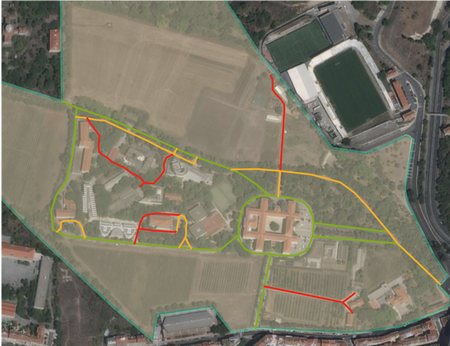

# Geographic Information Systems 2022-2023

# Exercise 7 - Editing - QGIS

## Introduction

TODO: Implementar com base no exercício de 2021-2022: 
- QGIS: [https://fenix.isa.ulisboa.pt/downloadFile/844497944592970/04LearningByExample.pdf](https://fenix.isa.ulisboa.pt/downloadFile/844497944592970/04LearningByExample.pdf)
- ArcGIS: [https://fenix.isa.ulisboa.pt/downloadFile/281547991167935/04LearningByExample_Editing_ArcGIS.pdf](https://fenix.isa.ulisboa.pt/downloadFile/281547991167935/04LearningByExample_Editing_ArcGIS.pdf)
- Dados:
    - [Ex4Editing.zip](https://fenix.isa.ulisboa.pt/downloadFile/844497944587499/Ex4Editing.zip)
    - [Topology intro](https://fenix.isa.ulisboa.pt/downloadFile/281547991168194/04Topology_intro.pdf)

Nota: renomear ficheiro de dados

> **GOALS OF THE EXERCISE**
>
> - Learn how to create or modify new vector geographic data set (gds)
> - Learn how to edit data in attribute tables
> - Learn how to create feature templates to speed up data creation

## Source data

We will use the area of Tapada da Ajuda for the exercise. 

- The files for this exercise are in the course web page (FENIX). Download to your working area the file `Ex07_Editing.zip`

- ArcGIS tool Basemap - Imagery (alternatively, use the provided tiff image)

## Practical goals
The aim of this exercise is to 
1. modify the shape of an existing feature, 
2. create a line layer with roads using a template, and
3. create a polygon layer with land parcels classified by its land use

## 1. Start by setting up your exercise environment:

1. Create a new QGIS project file;

2. Add the gds Boundary (GeoPackage format, CRS: ETRS89 / Portugal TM06, EPSG: 3763) to the map. In this case, it is not important to convert to file geodatabase format.

3. Add XYZ Tyles - Google Satellite or Bing as the background (recall Ex02 on how to do it). If there is no internet access, add the ISA.tif file provided

4. Set the Boundary transparency to 60% in the layer's symbology

5. Confirm that the QGIS project's CRS is ETRS89 / Portugal TM06 (EPSG: 3763), and this is the same CRS of the Boundary layer;

6. Create an empty folder named DataOut to store the new gds to be created.

7. Create a new geopackage inside DataOut folder named Tapada.gpkg, to store all new layers of the project

## 2. Modify an existing feature

The shape of the polygon in the layer Boundary needs to be adjusted in its limits, because its boundary overrides several areas. Edit the shape to adjust it to the limits in red shown in the figure.

1. Make a copy of the boundary layer called Boundary_correct to the Tapada.gpkg geopackage in the DataOut folder. Add it to the map, if necessary.

2. Start an editing session by selecting the tool Edit

3. In the Layers panel, make sure only Boundary_correct is selected for editing

4. In Digitizing toolbar, select **Vertex tool**

5. Hover the mouse cursor on the feature to be edited. You will notice that vertices 
are highlighted.

6. Click on a vertex to modify. Drag it to the desired position. 

7. If necessary, you can add mode vertices to the middle of segments - a plus sign appears. This allows more precision in defining the boundary. 

8. If necessary, you can delete vertices. Select them so they become blue, and delete using the DEL key. 

9. It is important to make all edits at the same scale. If you change the scale between different parts of the layer, for example zooming in in one part and zooming out in another, the level of accuracy will not be consistent. 

10. If needed, you can **undo** (Ctrl+Z) or **redo** (Ctrl+Y) your edits

8. Some of the modifications are easier to do with the **Reshape Features** tool. This is accessible from the **Advanced Digitizing toolbar**. You can add this toolbar to the QGIS interface with the menu View --> Toolbars.

9. For example, use it to reshape, in the bottom left corner, around the building. Start tracing outside the polygon, go around the building, and finish the trace again outside the polygon.

10. Save your edits frequently, and after finishing the edits.

## 3. Create a new line geometry layer to represent roads

We will create a new feature class of type line to create a layer with the roads of Tapada da Ajuda. These will be classified by the condition of the surface, as *Good*, *Fair* or *Bad*. This information will be stored in an attribute called `Status`.

The roads will be represented by lines. Every line is defined by an ordered set of vertexes (also called nodes). A straight line only requires a starting and an ending vertex (two vertexes). Vertexes between the starting and ending vertexes are required for shaping a line that is not a straight line. Although in ArcGIS you can create lines as arcs, these are composed by a series of vertices and straight line segments. Actually a GIS only stores vertex coordinates and their order within the set of vertexes shaping the line. This may cause a simplification of the geographic object representation concerning its location, the so-called feature generalization. The allowed level of feature generalization should be fixed for every gds, stated before its creation and evaluated for conformance before the gds is delivered – should be included in the gds metadata as well.

**QUESTION**. Could they be represented by points? Or by polygons? If yes, for any of the cases, in which situations? 

Because we know beforehand that the attribute `Status` will only have three values, we can create a template of the feature class with these values, which will speed up data insertion, and improve consistency and data quality.

1. On the Catalog pane, select the geopackage Tapada.gpkg, and New Feature Class in its context menu

    - Provide the name `Roads` and a feature type. Click Next

    - Create a new field named `Status`, of type text, with 10 characters of length. Click Next

    - Make sure the CRS is **ETRS 1989 Portugal TM06 (EPSG: 3763)**. Click Next

    - Verify the Tolerance, and its meaning. This parameter is important to determine the precision of our layer. Click Next

    - Accept all the rest of the values and click Finish.

2. Now, let’s create the template with the predefined values Good, Fair and Bad.

    - Open the Symbology pane of the layer

    - Select Unique values for the Primary Symbology

    - Select the field Status for the classes. The classes table will be empty, with no categories listed.
    
    - Click on the green plus sign, to add unlisted values. A new pane will open
    
    - Click Options → Add new value, and enter the three values *Good*, *Fair* and *Bad*

    - To make all line symbols thicker, select all while holding the Ctrl key, and click on More → Format all symbols

3. Before starting to digitize, it is important to set up and activate **Snapping**. This ensures that close vertices are overlaid, ensuring lines and polygons to be connected with each other. This is important to ensure a correct topology between features.

    - In the Edit menu, click on Snapping group, and select the snapping options

   
   - Click on Snapping settings, and define a value for XY tolerance. This can be set as a pixel or a map units value. Set is as 3 meters (map units)

   - You can also define the snapping tolerance by drawing a circle in the map with Se snapping tolerance, in which the radius of a drawn circle will be set as snapping distance. 
    
   - You can also try to define snapping with other values, to get the feeling how this will influence your precision in digitizing.

4. Let’s start to digitize your Roads layer

   - Make sure the layer is selected for editing in the Content pane

   - Click on Edit → Create. The right pane should open the Create Feature, with the Templates tab showing the three categories

   - Select the type of category of the road you will digitize.

   - Click the first vertex in the starting position of your road, and digitize placing vertices as needed. You can always undo.

   - Make wise decisions. If you digitize a long unique road, this will be classified as only one condition type. What happens if in the future one part of the road changes its status (is repaired or damaged)?

   - Save your edits regularly. You should have a result similar to the following

   - Open the attribute table of the newly digitized layer and verify that the attribute field Status contains the expected values

   - Add a new field with the name Length, which values should be the length of each feature

   - Calculate the total length of each type of road
        - in the attribute table, right click on the name of the field Status, and select Summarize
        - Set the output location the geopackage Tapada.gpkg, and the name oname of the output table road_type_length
        - Select as Statistics Field the field Length
        - As Case field, it should be selected the field Status 

**Remarks:**

- It will be necessary to decide where to start and to end a line – 1) the starting or/and the ending vertexes of a line must be located on a road intersection – an arc-node topological rule 2) start a new line whenever the road status changes

- Insert a vertex on every (foreseen) road intersection – an arc-node topological rule

- Save your edits often

## 4. Create a polygon layer

In this part of the exercise we will create a polygon layer with the parcels of Tapada da Ajuda, classified by its type of soil use. 

Soil use must be classified into two levels. First level includes 3 classes: Social area (code S), Forest (code FO) and Agriculture (code A).

Agriculture areas are further classified into: Wheat (code W), Corn (code C), Orchards (code O), Vineyard (code V), Olive (code L), Pastures (code P) and Fallow land (code F).

The following is an example of the soil use classification:

After creating your classification of the soil use, it will be possible to determine the total economic performance of the study area, considering the following data concerning the economic performance of crops:

| Code | Crop | Yield €/ha |
|------|------|------------|
| W    | wheat | 900 |
| C | corn | 1800 |
| P | pasture | 300 |
| V | vineyard | 17000 |
| O | orchard | 8000 |

In this kind of problem, all polygons are required to be adjacent (without overlapping and without gaps – empty regions or holes – between neighboring polygons) – the set of polygons must constitute a so-called coverage of the study area.

1. Create a new feature class in the geopackage Tapada.gpkg, of type polygon, with the name Parcels. 
   - It should have two fields in the attribute table - SoilUseL1, SoilUseL2 - of type text, with length of 2 characters. 

   - Ensure that the CRS is ETRS 1989 Portugal TM06 (EPSG: 3763). 

   - Add the layer to the map.

2. Make your outline of the Boundary layer visible, but not editable (verify the pencil option of the content pane).

3. Start editing the Parcels layer, adding polygons.

   - Make sure that snapping is active
  
   - In this case, we will not use a template. We will fill in the attribute table after the polygons are created
  
   - Create your first polygon. Click on the tool Create, and polygon, on the Create Feature pane, on the right

   - Start with a polygon near the Tapada boundary. When drawing the border of the polygon  that overlays the boundary, make sure to follow the vertices to make the two lines to completely overlay.
  
   - For the next polygon, which should be contiguous with the first one, it can share one the sides. You can use the tool 2 - Autocomplete Polygon - which can use one of the sides of the first polygon to autocomplete.
  
   - The tool 3 - Trace - is useful when you want to reuse a border of an existing feature. It will snap automatically to that line, to autocomplete a polygon.

   - To avoid open spaces between polygons, you can start by digitizing a large polygon of the whole area (or make a copy of the boundary layer), and then use the split tool to divide it into several parcels. Take a look at the series of tools available for feature modification at the Editor tool gallery.

  

   - Notice the Edit vertices tool, which you can use to move vertices as with line features

   - Another useful tool is Align Edges, which allows you to close gaps between edges that should overlay. Do use it, you need to activate Map Topology

  

   - Activating the Map Topology is also useful if you want to move vertices of an edge shared by two polygons. In that case, the edges of both polygons will move together.

   - Save your edits

4. Open the attribute table and fill in the values for the fields SoilUseL1 and SoilUseL2 for each feature. You may select each polygon with the Selection tool.

5. Verify any geometry problems with the tool Check Geometry (Data Management). A new table will be created with the problems detected. See online the help of the tool to see the list of problems it can identify. If problems are identified, you can use the Repair Geometry (Data Management).

6. Create a legend for the Parcels layer based on the Soil Use level 1 classification name.

7. Create a legend for the Parcels layer based on the Soil Use level 2 classification name.

8. Calculate the total economic performance of the study area, using the values for each crop in the table presented before.

