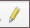

# Geographic Information Systems 2023-2024

# Exercise 7 - Editing - QGIS

## Introduction

> **GOALS OF THE EXERCISE**
>
> - Learn how to create or modify new vector geographic data set (gds)
> - Learn how to edit data in attribute tables
> - Learn how to create feature templates to speed up data creation

## Source data

We will use the area of Tapada da Ajuda for the exercise. 

- The files for this exercise are in the course web page (FENIX). [Download](https://fenix.isa.ulisboa.pt/downloadFile/844497944595574/Ex07_Editing.zip) to your working area the file `Ex07_Editing.zip`

- QGIS XYZ Tyles - Google  Satellite or Bing (alternatively, use the provided tiff image)

## Practical goals
The aims of this exercise are: 
1. to modify the shape of an existing feature, 
2. to create a line layer with roads using a template, and
3. to create a polygon layer with land parcels classified by its land use

## 1. Set up your working environment:

Start by setting up your exercise environment:

1. Create a new QGIS project file;

2. Add the provided gds `Boundary` (GeoPackage format, CRS: ETRS89 / Portugal TM06, EPSG: 3763) to the map.

3. Add XYZ Tyles - Google Satellite or Bing as the background (recall Ex02 on how to do it). If there is no internet access, add the ISA.tif file provided

4. Set the Boundary transparency to 60% in the layer's symbology

5. Confirm that the QGIS project's CRS is ETRS89 / Portugal TM06 (EPSG: 3763), and this is the same CRS of the Boundary layer;

6. Create an empty folder named DataOut to store the new gds to be created.

7. Create a new geopackage inside DataOut folder named `Tapada.gpkg`, to store all new layers of the project

## 2. Modify an existing feature

The shape of the polygon in the layer Boundary needs to be adjusted in its limits, because its boundary overrides several areas. Edit the shape to adjust it to the limits in red shown in the figure.

1. Make a copy of the boundary layer called `Boundary_correct` to the `Tapada.gpkg` geopackage in the `DataOut` folder. Add it to the map, if necessary.

2. Start an editing session by selecting the tool **Edit**

3. In the Layers panel, make sure only `Boundary_correct` is selected for editing

4. In Digitizing toolbar, select **Vertex tool**

5. Hover the mouse cursor on the feature to be edited. You will notice that vertices are highlighted.

6. Click on a vertex to modify. Drag it to the desired position. 

7. If necessary, you can add mode vertices to the middle of segments - a plus sign appears. This allows more precision in defining the boundary. 

8. If necessary, you can delete vertices. Select them so they become blue, and delete using the DEL key. 

9. It is important to make all edits at the same scale. If you change the scale between different parts of the layer, for example zooming in in one part and zooming out in another, the level of accuracy will not be consistent. 

10. If needed, you can **undo** (Ctrl+Z) or **redo** (Ctrl+Y) your edits

8. Some of the modifications are easier to do with the **Reshape Features** tool. This is accessible from the **Advanced Digitizing toolbar**. You can add this toolbar to the QGIS interface with the menu **View --> Toolbars**.

9. For example, use it to reshape, in the bottom left corner, around the building. Start tracing outside the polygon, go around the building, and finish the trace again outside the polygon.

10. Save your edits frequently, and after finishing the edits.

## 3. Create a new line geometry layer to represent roads

We will create a new feature class of type line to create a layer with the roads of Tapada da Ajuda. These will be classified by the condition of the surface, as *Good*, *Fair* or *Bad*. This information will be stored in an attribute called `Status`.

Roads will be represented by lines. Every line is defined by an ordered set of vertexes (also called nodes). A straight line only requires a starting and an ending vertex (two vertexes). Vertexes between the starting and ending vertexes are required for shaping a line that is not a straight line. The line segments defined by two sequential vertexes (considering the ordered set of vertexes) are assumed to be straight line segments. 

Actually, a GIS only stores vertex coordinates and their order within the set of vertexes shaping the line. This may imply a simplification of the geographic object representation concerning its location, the so-called *feature generalization*. The allowed level of feature generalization should be fixed for every gds, stated before its creation and evaluated for conformance before the gds is delivered. It should be included in the gds metadata as well.

**QUESTION**. Could they be represented by points? Or by polygons? If yes, for any of the cases, in which situations? 

**1. Create a new gds (file format GeoPackage) to store the lines representing roads**

   - **Remark 1**: a gds in GeoPackage format is a table inside a SQLite database; a SQLite database is composed by tables (as described in the Relational Database Model topic of this course)
   - **Remark 2**: a SQLite database can store more than one gds (vector or raster) using a different table for every gds
   - **Remark 3**: therefore, when creating a new gds in a new GeoPackage file, it is necessary to enter a name for the new database file and another name for the table to store the geographic data set; when creating a new GeoPackage gds, QGIS suggests the database name as the new table name by default but it is possible to override it entering a different table name
 

- 1.1. Use the menu Layer / Create Layer / New GeoPackage Layer ...

- 1.2. Name the new database `ISA` (under your DataOut folder for this exercise)

- 1.3. Name the new database table `Roads`

- 1.4. Choose the appropriate geometric type (Line)

    - **Remark**: QGIS supports geometric types No geometry (data tables), Point, Line, Polygon, MultiPoint, MultiLine, MultiPolygon, among others – a MultiLine (also called multipart line) is a complex feature composed by more than one non-contiguous line; MultiPoint and MultiPolygon definitions are analogous; the multipart points geometry is suitable to represent sets of geographic objects (geometry point) sharing the same attribute values (non-spatial characteristics) – for instance, to represent archipelagos composed by several islands; multipart lines/polygons are suitable to represent non-contiguous/non-adjacent features sharing the same attribute values (non-spatial characteristics)

- 1.5. Choose the `EPSG: 3763 CRS`

- 1.6. Add one attribute to this new gds named status, choosing the appropriate data type according to the foreseen values (*Good*, *Bad*, *Fair*, for instance)

**2. Setting the QGIS environment for editing roads**

A road must always connect to other road(s), by sharing the same vertex. QGIS tool Snapping allows to ensure building a connected network, through Search Radius and Snapping settings. Without setting the QGIS environment it will be impossible to connect lines, even if they seem to be connected at a given scale, zooming in will show that they are not connected.

- 2.1. Setting the Search Radius

  - **Remark 1**: the Search radius is the distance QGIS uses to search for the closest vertex you are trying to select when you click on the map; if you aren’t within the search radius, QGIS will not find and select any vertex for editing and gaps between lines will occur;
  - **Remark 2**: the Search radius unit can be either map units or pixels – choosing pixels turns the search radius usage independent of the zooming scale; the best search radius units and value choices depend on the specific data characteristics at every moment of the editing work
  - **Remark 3**: the Search radius for the project is defined using the Setting menu / Options / Digitizing window (inside the Snapping section) – set the Search Radius to 5 m (map units) to start and adjust it later as necessary

- 2.2. Enable Snapping for this layer in order to avoid roads that do not connect to other roads, due to very small digitizing errors

  - **Remark 1**: Common digitizing errors – supposing the two lines should actually intersect, the so-called error of omission and error of commission occur in the following situations:

Unless appropriate search radius and snapping (mode and tolerance) are set, these kind of errors will always occur; to detect them, sometimes, it is necessary to zoom in to a very large scale of visualization The search radius and snapping option usage can help on avoiding to have to correct digitizing errors later on

   - **Remark 2**: The snapping definition includes the snapping mode definition – either vertex or segment or both – and the snapping tolerance definition (value and units). The snapping tolerance is the distance QGIS uses to search for the closest vertex and/or segment you are trying to connect to when you create a new vertex or move an existing vertex. If you aren’t within the snapping tolerance, QGIS will leave the vertex where you release the mouse button, instead of snapping it to an existing vertex and/or segment

  - **Remark 3**: It is possible to define a default snapping for the project using the Setting menu / Options / Digitizing window (inside the Snapping section). However, the right snapping parameter values (mode and tolerance) usually depend on the layer data specific characteristics. Therefore, the layer snapping definition is almost always required and it is normally always useless to set a default snapping for the whole project

  - **Remark 4**: Set the snapping mode to vertex and set the snapping tolerance to 5 m (map units) to start (adjust it later as necessary); in order to define the layer snapping parameters (mode and tolerance) use the Project menu / Snapping Options ... window as following:

  - **Remark 5**: The Topological Editing and Avoid intersection options only are active on polygons. The snapping on intersection option is intended to snap to features on other layers (for now, only snapping of lines of layer Roads is required)

  - **Remark 6**: The layer snapping definition overrides the project snapping definition mentioned in remark 3

**3. Create in the new gds named Roads the roads located inside the Boundary polygon**

- 3.1. On the `Roads` layer's context menu / Symbology window, choose a bright color for the lines (other than red) and set width to 1 mm

- 3.2. Activate the layer Roads and use the **Toggle Editing** buton  to turn on the editing mode 
  - **Remark**: After activating the appropriate layer, to turn on the editing mode use the Toggle Editing button (in the Digitizing toolbar)

- 3.3. Use the **Add Line Feature button**  (in the **Digitizing Toolbar**) to create a new line representing a road. Start by creating the first line vertex (click the mouse over the background image on a road intersection), keep on adding vertexes (clicking over the background image) to follow the road shape; after inserting the last vertex, write click the mouse to end the line

  - **Remark 1**: It will be necessary to decide where to start and to end a line:
     – the starting or/and the ending vertexes of a line must be located on a road intersection 
     – start a new line whenever the road status changes

  - **Remark 2**: Insert a vertex on every (foreseen) road intersection

  - **Remark 3**: If necessary, in the **Setting menu --> Options --> Digitizing** window (inside the Rubberband section) increase the line width and change the Line and Fill colors

- 3.4. In the attribute values dialog box, leave the fid attribute value as Autogenerate and enter the status attribute value (*Good*, *Fair* or *Bad*) of the road

  - **Remark**: It is possible either 
    - a) to record each feature geometry and attribute values or 
    - b) to record several/all the features geometry and, only after, to open the layer attribute table and to record every feature attribute value. 

   By default, the a) option is on. Use the menu **Settings --> Options --> Digitizing** window to enable (inside the Feature creation section) Suppress attribute form pop-up after feature creation in order to set on the b) option. The b) option is usually more efficient but it requires some additional precautions ...

- 3.5. Open the layer attribute table and analyze the result (the fid attribute values will be automatically created whenever you Save Layer Edits)

  - **Remark**: To Save Layer Edits use the **Save Layer Edits**  button (in the Digitizing Toolbar – not the Save Project button in the Project toolbar!)

- 3.6. Zoom in to the new line and analyze the result. If necessary, correct the line shape using the **Vertex Tool**  button to move vertexes, to add new vertexes or to delete vertexes

  - **Remark 1**: when the Vertex Tool is activated, red circles will appear when hovering vertexes

  - **Remark 2**: adding vertexes is often necessary to correct a line, in order that it better fits the actual shape of the real-world object. This is possible while hovering an existent straight segment line, where a virtual new vertex appears on the segment center, and just click on it to add a new vertex and click again to position it. Double click on any location of the boundary also creates a new vertex. For lines, a virtual vertex is also proposed at both extremities to enable to extend it

  - **Remark 3**: selecting vertexes – several vertexes can be selected by clicking on them, one at a time, holding Shift key pressed, or by clicking and dragging a rectangle around some vertexes; when a vertex is selected, its color changes to blue; to add more vertexes to the current selection, hold down the Shift key while clicking; to remove vertexes from the selection, hold down the Ctrl key and click on the vertex to be removed

  - **Remark 4**: deleting vertexes – often necessary to delete superfluous vertexes inside straight segment lines – select the vertexes and press the Delete key; do not delete all the vertexes of a feature otherwise a geometryless feature (a meaningless feature) is generated; to delete a feature, select it using the Select Features button, as usual, and press de Delete key

  - **Remark 5**: moving vertexes – select all the vertexes you want to move, click on a selected vertex or edge, and click again on the desired new location – all the selected vertexes will move together

  - **Remark 6**: each change made with a vertex/feature is stored as a separate entry in the Undo memory; use the Crtl Z keys to undo the last change(s) (so many times as necessary)

- 3.7. Repeat the procedure in order to record a few more roads and Save Layer Edits quite often

- 3.8. Stop Editing and save edits

  - **Remark**: To turn off the editing mode use again the **Toggle Editing**  button (in the Digitizing toolbar)

- 3.9. Compute the total length of roads

  - **Hint**: Create a new temporary layer by dissolving all roads and ...

  - Remark: Try the menu Vector / Analysis Tools / Basic Statistics for Fields ... as well

- 3.10. Compute the total length of good, fair and bad roads

You should target a final Roads layer similar to the following:

## 4. Create a new polygon geometry layer to represent land use

Create a new gds (SoilUse) representing soil use inside the study area that is represented in the following figure. 

Soil use must be classified into two levels. First level includes 3 classes: Social area (code S), Forest (code F) and Agriculture (code A). Agriculture areas are further classified into: Wheat (code W), Corn (code C), Orchards (code O), Vineyard (code V), Olive (code L), Pastures (code P) and Fallow land (code F).

Parcels will be represented by polygons. Every polygon is defined by an ordered set of vertexes (also called nodes) and the start and ending vertexes must coincide (a so-called closed line). A polygon requires at least three vertexes starting and an ending vertex (two vertexes). The line segments defined by two sequential vertexes (considering the ordered set of vertexes) are assumed to be straight line segments. This may cause the simplification of a geographic object representation concerning its location, the so-called feature generalization. In this kind of problems all polygons are required to be adjacent (without overlapping and without gaps – empty regions or holes – between neighboring polygons) – the set of polygons must constitute a so-called coverage of the study area.

**4.1. Create a new gds (file format GeoPackage)**

- Use the menu Layer / Create Layer / New GeoPackage Layer …
- Choose the database `ISA` (under your DataOut folder) created previously (see 3, Point 1) 
- Name the new database table `Parcels`
- Choose the appropriate geometric type (polygon)
- Choose the EPSG: 3763 CRS
- Add one attribute to this new gds named soilUseL2 to store the soil use classification code level 2, choosing the appropriate data type according to the foreseen values 
- be careful: you do not want to overwrite the `ISA` database (loosing the gds Roads that you previously created); you only want to add a new layer to the database!

**4.2. Set the QGIS environment suitable for editing parcels purposes (a coverage)**

For this layer, snapping must be enabled, overlapping polygons are not allowed and Topological Editing must be enabled

- Set the **Search Radius** to 5 m to start and adjust it later as necessary (review 2.1 if necessary)
- Enable **Snapping** for this layer in order to avoid gaps among neighboring polygons – set the snapping mode to vertex and segment (also called edges) and set the snapping tolerance to 5m to start and adjust it later as necessary (review 2.2 if necessary)
- Enable the **Avoid intersection** option in order to prevent overlapping polygons (review 2.2 if necessary)
- Enable **Topological Editing** so that, when a vertex shared by more than one polygon is moved, all polygons sharing that vertex will change accordingly (review 2.2 if necessary)

**4.3. Add to the project the Advanced Digitizing toolbar** 
Right-click in the toolbars area and activate it in the context menu

**4.4. Record in the new gds named Parcels polygons representing the parcels inside the Boundary polygon**
 - On the layer Parcels context menu / Symbology window, choose Simple fill inside the Fill section, then choose No Brush as Fill style, a bright color as Stroke color for the polygon edges (other than red and the ones being used by roads and by the boundary polygon) and set the Stroke width to 1mm
- Activate the layer Parcels and turn on the editing mode
   - **Remark**: After activating the appropriate layer, to turn on the editing mode use the
      Toggle Editing  button (in the Digitizing toolbar)
- Use the **Add Polygon Feature**  button (in the Digitizing Toolbar) to create a new polygon representing a very small parcel; start by creating the first polygon vertex (click the mouse over the background image), keep on adding vertexes (clicking over the background image) to follow the parcel shape; after inserting the last vertex (the vertex before the starting vertex), write click the mouse to end the polygon – avoid clicking more than once at a given location otherwise several (useless) overlapping vertexes will be created
- Delete this first polygon
   - **Remark 1**: Repeating the above procedure would force edges that are shared by adjacent polygons to be stored in the gds twice; in coverages this duplication must be avoided (gaps between neighboring polygons can easily occur due to small digitizing errors)
- In order to create a coverage, it is strongly recommended to start digitizing one polygon representing the whole study area – create one starting vertex (clicking the mouse) and all the required vertexes to shape the study area; after digitizing the last vertex, write click the mouse to end this polygon; zoom in over the polygon and correct the study area boundary vertexes using the **Vertex Tool**  button as necessary (review 3.6)
- After considering that the polygon is as correct as possible, use the **Save Layer Edits**  button to save it in the Geopackage file (and save layers edits often from now on)
- In order to create the parcels inside the polygon representing the study area previously created, it is possible to use the following tools:
   - **Split Features**  – to create a new polygon by subdivision of an existent one; it is only necessary to create the vertexes of the line that will “cut” the polygon – this line must start and end on edges of the former polygon (or outside this polygon); after inserting the last vertex, write-click to end this line
   
   - **Fill Ring**  – to create a land parcel inside another already existent land parcel (and leading a ring polygon creation – the outside polygon); it is only necessary to create the vertexes of the polygon that will “cut” an existent polygon – this new polygon must start and end inside a former polygon; after inserting the last vertex, write-click to end the new polygon creation (and the update of the former polygon shape)
     - **Remark**: the Add Ring tool creates a special polygonal geometry, the so-called donut – a polygon containing inside an empty hole; a donut boundary (like a ring boundary) is composed by more than 1 polygonal line; according to the topological rules that define a coverage, donuts are not allowed in the Parcels gds
        
   - **Add Polygon Feature**  – to create a land parcel adjacent and outside another already existent land parcel; it is necessary to insert at least one vertex inside a former polygon, overlapping at least one already existent polygon; after right clicking to end the new polygon, QGIS will automatically clip this new polygon so that it will be adjacent to the other polygon(s)
   - The use of the **Simplify Feature** tool  is also recommended – it cleans useless vertexes (overlapping or too close vertexes, unnecessary to shape a feature) created due to digitizing errors that are difficult to avoid; this kind of digitizing errors may cause several errors when the gds are used as input data of spatial operations

- Finally, correct the parcels location using the **Vertex Tool**  (review 3.6); verify that the changes made on vertexes shared by adjacent polygons change all these polygons (this kind of action does not create neither empty holes nor overlapping polygons provided the Topological Editing option is enabled – review 5.4)
  - **Remark**:	When using the Vertex tool on a feature, it is possible to right click over a vertex to open the Vertex Editor panel listing all the vertexes of the feature with their x, y coordinates; selecting a row in the table selects the corresponding vertex in the screen and vice versa; changing a coordinate value in the table updates the vertex position

- On the attribute values dialog box, leave the fid attribute value as Autogenerate and enter the attribute `soilUseL2` value (a code) of every parcel – use the codes mentioned before, for instance, code ‘S’ for social areas and ‘X’ for forest areas (actually these 2 last classes do not have a level 2 classification but it is necessary to create them in order that the involved tables – to be created on point 10 - verify the 1stNF; use unique codes – for instance, ‘F’ cannot be used for Forest because it is already used for Fallow land)
  - **Remark**:	It is possible either:
    - a) to record each feature geometry and attribute values or 
    - b) to record several/all the features geometry and, only after, to open the layer attribute table and to record every feature attribute value. 
    
    The a) option is on by default. Use the menu Settings / Options / Digitizing window to enable (inside the Feature creation section) Suppress attribute form pop-up after feature creation in order to set on the b) option. The b) option is usually more efficient but it requires some additional precautions …

**4.5 Exit editing mode saving edits**

**4.6 Check geometries**

The Geometry Checker is a core plugin to check and fix the geometry validity of a gds that can be very useful mainly to create coverages without topological errors – sliver polygons and other errors
  - **Remark**:	Plugins are functions that users can manage – install, uninstall, enable, disable according to the computer processor and memory being used; some plugins are installed automatically because they were included in the QGIS core – only some of these plugins are enabled by default
  
  - Use the Plugins menu / Manage and Install Plugins … / Installed window to enable the **Geometry Checker plugin**

  - Use the Vector menu / Check geometries …, set some of this function parameters to a value appropriate to the Parcels gds and execute this function – correct the identified errors if necessary

**4.7 Create additional table**
  - Create a .csv file (using MS Excel, for instance) in the folder DataOut to record the two levels of soil use classification (codes and names) and upload them into the QGIS project 

**4.8. Create a legend for the Parcels layer based on the Soil Use level 1 classification name**

**4.9. Create a legend for the Parcels layer based on the Soil Use level 2 classification name**

**4.10. Create a new gds with mutipart polygons representing the soil use according to the Soil Use level 1 classification.**

**4.11. Calculate the total economic performance of the study area**
Considering the following data concerning the economic performance of crops:

| Code | Crop | Yield €/ha |
|------|------|------------|
| W    | wheat | 900 |
| C | corn | 1800 |
| P | pasture | 300 |
| V | vineyard | 17000 |
| O | orchard | 8000 |

Determine the total economic performance of the study area.
