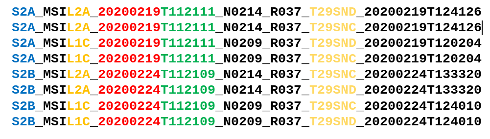

# Geographic Information Systems 2022-2023

# Exercise 9 - Calculation of NDVI indices

## Introduction

TODO: Implementar com base no exercício de 2021-2022: 
- QGIS: [https://fenix.isa.ulisboa.pt/downloadFile/844497944586896/Ex2a%20PA.pdf](https://fenix.isa.ulisboa.pt/downloadFile/844497944586896/Ex2a%20PA.pdf)
- ArcGIS: [https://fenix.isa.ulisboa.pt/downloadFile/281547991168534/05a_PrecisionAgriculture_ArcGIS.pdf](https://fenix.isa.ulisboa.pt/downloadFile/281547991168534/05a_PrecisionAgriculture_ArcGIS.pdf)
- Dados:
    - [pivots.zip](https://fenix.isa.ulisboa.pt/downloadFile/844497944586758/pivots.zip)


Nota: renomear ficheiro de dados


## Introduction

> **GOALS OF THE EXERCISE**
>
> - NDVI analysis of 2 (close) pivot areas along the crop lifecycle 

## NDVI analysis using ArcGIS

The **normalized difference vegetation index (NDVI)** is a simple indicator that can be used to analyze **remote sensing** measurements assessing whether or not the target being observed contains **live green vegetation**.

NDVI = NIR - RedNIR + Red = NIR - Red/(NIR + Red) 

- Negative values of NDVI (values approaching -1) correspond to water. 
- Values close to zero (-0.1 to 0.1) generally correspond to barren areas of rock, sand, or snow. 
- Low, positive values represent shrub and grassland (approximately 0.2 to 0.4)
- High values indicate a large presence of biomass (values approaching 1).

Within **precision agriculture** applications, NDVI data provides a measurement of crop health

## 1. Set up your working environment:

**Vector data**

- The files for this exercise are in the course web page (FENIX). [Download](https://fenix.isa.ulisboa.pt/downloadFile/844497944595944/Ex08_Interpolation.zip) to your working area the file `Ex09_pivots.zip`
- The two polygons in the provided data represent the 2 pivot areas. Learn more about 
[irrigation pivots](https://en.wikipedia.org/wiki/Center-pivot_irrigation). 


**Raster data**

- Your raster layers will be satellite images from the Copernicus service (Sentinel 2 images).

You will access to the free [Copernicus Open Access Hub](https://scihub.copernicus.eu/) service to download:

- Source of input data: Sentinel 2 imagery
- Available via Copernicus Open Access Hub (OAH)
- or via SeNtinel Applications Platform (SNAP)
- Registration required on the Copernicus Open Access Hub. Create your account to get a username and password at [Copernicus Open Access Hub](https://scihub.copernicus.eu/dhus/)

**Download data:**

- Select the area for download and additional selection criteria:
    - Sensing period: start and end dates
    - Select Sentinel-2
    - Cloud cover: define a limit to up to 20% cover, writing “[0 TO 20]”. You may try other values.


## 2. Information about Sentinel 2 imagery (summary)

- Orthorectified images (products)
    - Tiles 100x100km projection UTM/WGS84
    - Level 1C - Top-of-atmosphere reflectances in cartographic geometry
    - Level 2A - Bottom-of-atmosphere reflectance in cartographic geometry - includes corrections to atmosphere
- Bands (13 available)
    - Spatial resolution 10m:
        - Band 2 – Blue
        - Band 3 – Green
        - Band 4 – Red
        - Band 8 – infrared

Sentinel 2 imagery (examples):

Example data: February 2020 products (pivot areas)



```
S2A_MSIL2A_20200219T112111_N0214_R037_T29SND_20200219T124126
S2A_MSIL2A_20200219T112111_N0214_R037_T29SNC_20200219T124126
S2A_MSIL1C_20200219T112111_N0209_R037_T29SND_20200219T120204
S2A_MSIL1C_20200219T112111_N0209_R037_T29SNC_20200219T120204
S2B_MSIL2A_20200224T112109_N0214_R037_T29SNC_20200224T133320
S2B_MSIL2A_20200224T112109_N0214_R037_T29SND_20200224T133320
S2B_MSIL1C_20200224T112109_N0209_R037_T29SNC_20200224T124010
S2B_MSIL1C_20200224T112109_N0209_R037_T29SND_20200224T124010
```

Each product is a zip file, after unzipping it, images are in
\<productName\>.SAFE\GRANULE\\<productName1\>\IMG_DATA\R10m


## 3. Calculate NDVI using the tool Raster Calculator

- Combine the several bands into one image with the tool “Composite Bands” 
- Add the bands to your map
- Calculate the index in Raster Calculator using the formula above


## 4. Calculate NDVI using ArcGIS Imagery

Select Imagery → Raster Functions → NDVI or NDVI Colorized


## 5. More information

- About Copernicus Sentinel 2 - https://sentinel.esa.int/documents/247904/4180891/Sentinel-2-infographic.pdf
- Tutorials on accessing satellite data:
    - https://www.copernicus-user-uptake.eu/fileadmin/FPCUP/dateien/resources/2018-1-06/Guide_basics_satellite_data_english.pdf 
    - https://appliedsciences.nasa.gov/sites/default/files/2021-10/Part2_Data-Download_EN.pdf  
- https://www.youtube.com/watch?v=l58bUCW2UlU (&QGIS)
- https://www.youtube.com/watch?v=tu9kFbMhGV0 (Quick tutorial on Sentinel Hub)
- https://www.youtube.com/watch?v=9Jp8BBiZPsI (&QGIS)
- https://rus-training.eu (it is unnecessary to install the RUS virtual machine!)
- https://www.youtube.com/watch?v=jpPoZ6wv9dM (GEARS – RUS WEBINAR & OAH)
- https://www.youtube.com/watch?v=vtlN5MXYGaY (GEARS – RUS WEBINAR & SNAP)
- https://www.youtube.com/watch?v=xEwy8UMGu7M (GEARS – RUS WEBINAR)
