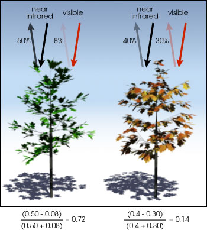

# Geographic Information Systems 2022-2023

# Exercise 9 - Calculation of NDVI indices


## Introduction

> **GOALS OF THE EXERCISE**
>
> - NDVI analysis of 2 (close) pivot areas along the crop lifecycle 

## Spectral Remote Sensing

Satelitte images are produced by the capture of the reflection of the Sun light by the Earth. Satellites contain multispectral sensors, which capture, for the same location on the surface, different parts - ranges of wavelenghts - of the spectrum of the visible and near visible light. These different ranges are called bands. Therefore, a multi-band-raster image is a raster image composed of a combination of different bands. For example, the Sentinel 2 satellite images contain 13 bands.

## NDVI analysis

The **normalized difference vegetation index (NDVI)** is a simple indicator that can be used to analyze **remote sensing** measurements assessing whether or not the target being observed contains **live green vegetation**. It provides an indicator of the health or structure of the vegetation.

Actively photosysthetic vegetation is known to absorve visible light and reflect near-infrared light, while vegetation under drought stress, or lower chlorophyll content, will absorve less visible light.

See the following example (source: [NASA](https://earthobservatory.nasa.gov/features/MeasuringVegetation/measuring_vegetation_2.php)):



Therefore, considering the following index expression:

```
NDVI = (NIR - Red)/(NIR + Red)
```
where
NIR - near-infrared band
Red - red band

you can analyse satellite images of the Sentinel 2 service to determine the NDVI index, where:

- Negative values of NDVI (values approaching -1) correspond to water. 
- Values close to zero (-0.1 to 0.1) generally correspond to barren areas of rock, sand, or snow. 
- Low, positive values represent shrub and grassland (approximately 0.2 to 0.4)
- High values indicate a large presence of biomass (values approaching 1).

Within **precision agriculture** applications, NDVI data provides a measurement of crop health. 

## 1. Set up your working environment:

**Vector data**

- The files for this exercise are in the course web page (FENIX). [Download](https://fenix.isa.ulisboa.pt/downloadFile/844497944595944/Ex08_Interpolation.zip) to your working area the file [Ex09_pivots.zip](https://fenix.isa.ulisboa.pt/downloadFile/281547991171207/Ex09_pivots.zip)
- The two polygons in the provided data represent the 2 pivot areas. Learn more about [irrigation pivots](https://en.wikipedia.org/wiki/Center-pivot_irrigation). 


**Raster data**

- Your raster layers will be satellite images from the Copernicus service (Sentinel 2 images).

You will access to the free [Copernicus Open Access Hub](https://scihub.copernicus.eu/) service to download:

- Source of input data: Sentinel 2 imagery
- Available via Copernicus Open Access Hub (OAH)
- or via [SeNtinel Applications Platform (SNAP)](https://step.esa.int/main/download/snap-download/) (desktop application)
- Registration required on the Copernicus Open Access Hub. Create your account to get a username and password at [Copernicus Open Access Hub](https://scihub.copernicus.eu/dhus/)

To download Sentinel 2 satellite imagery from the Coperinus Open Access Hub, you need to select the geographic area or interest for download and set additional selection criteria:
    - Sensing period: start and end dates
    - Select Sentinel-2
    - Cloud cover: define a limit to up to 20% cover, writing “[0 TO 20]”. You may try other values.

Check the [ESA tutorial on how to download](https://appliedsciences.nasa.gov/sites/default/files/2021-10/Part2_Data-Download_EN.pdf) from the Copernicus Open Access Hub.

## 2. Information about Sentinel 2 imagery (summary)

- Orthorectified images (products)
    - Tiles 100x100km projection UTM/WGS84
    - Level 1C - Top-of-atmosphere reflectances in cartographic geometry
    - Level 2A - Bottom-of-atmosphere reflectance in cartographic geometry - includes corrections to atmosphere
- Bands (13 available)
    - Spatial resolution 10 m:
        - Band 2 – Blue
        - Band 3 – Green
        - Band 4 – Red
        - Band 8 – infrared


## 3. Download images from Copernicus Open Access Hub

1. Draw with your mouse the area of interest
    - you might prefer to use as basemap the satellite imagery, to better identify the pivots' area.

2. Define the following filter parameters
    - Define the sensing period between 2023-02-01 and 2023-04-01
    - Mission: `Sentinel-2`
    - Sattelite Platform: `S2A_*`
    - Product type: `S2MSI2A`
    - Could Cover %: `[0 TO 20]`

3. Download one product (images) for the beginning of February, and another for latest March, for your area. Make sure the image fully covers the pivots in the area of interest

Each product is downloaded in a zip file. The name of the file contains metadata. See the following example, for products for February 2020 products (pivot areas)


After unzipping it, images of 10 m resolution are in the folder:
`<productName>.SAFE\GRANULE\<productName>\IMG_DATA\R10m`

## 4. Create a visualization of the image with visible bands

1. Add bands 2, 3, 4 and 8 to your GIS project

2. Create a composite bands image. 
    - in ArcGIS, use the tool Composite Bands
    - in QGIS, use the menu Raster -> Miscellaneous -> Build Virtual Raster
        - make sure to check the option *Place each input file into a separate band*

3. Create a symbology. Make sure to select the correct band for each color. Also make sure to try the different options of contrast enhancement and min/max value settings, or stretch (depending if it is in QGIS or ArcGIS), and see the effect in the image rendering. 

## 5. Calculate NDVI using the tool Raster Calculator

- Calculate the NDVI index in Raster Calculator for the begining of February, using the formula of above
- Do a **Clip raster by mask layer** (in QGIS) of **Extract by Mask** (ArcGIS), in order to clip, the  areas of pivots 1 and 2.
- Calculate the histogram for each of the pivots, and compare them. Which of the pivots do you think has better crop vitality in that period
- repeat the index calculation for late March images, and compare the histogram with the begining of February.

## 6. Additional exercise - Visualize SWIR

The Short Wave Infrared RGB Composite (SWIR) is a composite image that combines, for Sentinel 2, **bands B12, B8A and B04**. This composite can identify how much water is present in plants and soil. One use of this composite is to identify recently fire burnt land, as these areas reflect strongly in SWIR bands.

We can check an example based on the forest fire that occurred in the Natural Park of Serra da Estrela, center Portugal, in August 2022.

1. Download images from Copernicus Open Access Hub
    - Find the locality Manteigas, which is between Castelo Branco and Guarda district capitals, in the center-east of Portugal
    - draw a small area around the locality of Manteigas, to identify the area of interest.

2. Define the following filter parameters
    - Define the sensing period between 2022-08-01 and 2022-08-31
    - Mission: `Sentinel-2`
    - Sattelite Platform: `S2A_*`
    - Product type: `S2MSI2A`

3. Select the product `S2A_MSIL2A_20220827T112131_N0400_R037_T29TPE_20220827T185854` to download

4. Add bands 12, 8A and 04. Note that these bands only exist for resolution of 20 m or 60 m.

5. Create a Virtual Raster (in QGIS) or Composite Bands (in ArcGIS), as before.

6. Create a multiband color symbology. Make sure that the colors red, green and blue correspond to the bands 12, 8A and 04, in this order.

7. Observe the areas in red, which correspond to fire burnt areas.


## 7. More information

- About Copernicus Sentinel 2 - https://sentinel.esa.int/documents/247904/4180891/Sentinel-2-infographic.pdf
- Tutorials on accessing satellite data:
    - https://www.copernicus-user-uptake.eu/fileadmin/FPCUP/dateien/resources/2018-1-06/Guide_basics_satellite_data_english.pdf 
    - https://appliedsciences.nasa.gov/sites/default/files/2021-10/Part2_Data-Download_EN.pdf  
- https://www.youtube.com/watch?v=l58bUCW2UlU (&QGIS)
- https://www.youtube.com/watch?v=tu9kFbMhGV0 (Quick tutorial on Sentinel Hub)
- https://www.youtube.com/watch?v=9Jp8BBiZPsI (&QGIS)
- https://rus-training.eu (it is unnecessary to install the RUS virtual machine!)
- https://www.youtube.com/watch?v=jpPoZ6wv9dM (GEARS – RUS WEBINAR & OAH)
- https://www.youtube.com/watch?v=vtlN5MXYGaY (GEARS – RUS WEBINAR & SNAP)
- https://www.youtube.com/watch?v=xEwy8UMGu7M (GEARS – RUS WEBINAR)
