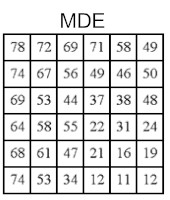
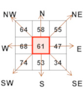
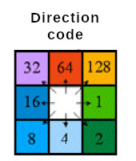
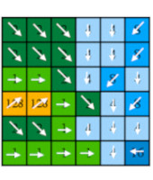

# Geographic Information Systems 2022-2023

# Exercise 11 - Determine a dam implantation area

## Introduction

> **GOALS OF THE EXERCISE**
>
> - edit 3D data
> - create a DEM and TIN to model terrain surface


**Problems**:

- Represent the dam on the map, this means to model the study area relief after the dam is built.

- To delineate the dam watershed. 

- To calculate the flooded area and the volume of water in the dam reservoir when it is filled up to 595m.


## Source data

- The files for this exercise are in the course web page (FENIX). [Download](https://fenix.isa.ulisboa.pt/downloadFile/281547991171495/Ex11_DAM.zip) to your working area the file `Ex11_DAM.zip`

The data provided contains the following:
- `ApartaduraContours` - 3D shapefile of the contour lines for the study area
- `ApartaduraHydrol` - 3D shapefile of the water streams of the study area
- `ApartaduraRidges` - 3D shapefile with the lines of ridges in the study area
- `DamWall` - 3D shapefile of lines that define the dam wall


## 1. Deployment of the dam on the map

The construction of the dam wall will modify the surface of the land, altering the water lines, the contour lines and the ridges. It is necessary to know the shape of the wall surface (represented in contour lines). This information is provided in the gds `DamWall` (feature polyline 3D). The contours of the terrain and the water lines inside the polygon that delimits the horizontal projection of the dam wall will be erased and replaced by the contours of the dam wall. The dam projection polygon can be used to erase the water lines and contour lines from its interior.

Steps to implement:

## 1. Create a gds of polygons (3D) corresponding to the projection of the dam wall 
    
    
- create a polygon theme (`DamWallPolyg`) from the theme of lines representing the dam wall DamWall. 
    
- With a suitable spatial operation on vector gds, erase the water lines and contours inside the wall projection polygon:

    - create a theme (`ApartBarr_hid`) with the water lines that are not under the dam wall, based on the gds `ApartaduraHydrol`. Erase the contours from the interior of the projection polygon

    - create a theme (`ApartBarr_alt`) with contours that are not under the dam wall, based on the gds `ApartaduraContours`

- Create a TIN named `TINApartadura`, setting `ApartBarr_hid` and `ApartaduraRidges` as **hardline**, `ApartBarr_alt` and `DamWall` as **softline**. 
    - In QGIS:
        - use 20 m as pixel size    
        - `ApartaduraContours` as Extent

## 2. Delimit the hydrographic basin of the dam

This operation is performed on a digital elevation model (DEM) in matrix format (raster) using spatial analysis tools that perform raster operations. The dam's watershed is delimited by a ridge line, which, starting on one side of the dam, goes around a surface of the land that contains all the water streams that will contribute to the dam, and ends at the other end of the dam wall. Within this basin there are several hydrographic sub-basins, corresponding to different effluents.

- Create the DEM of the study area in raster format by converting `TINApartadura` to raster with the name `DEMApartadura` (TIN to Raster; in “sampling distance” choose “CELLSIZE” and value 20 to obtain a grid with a spatial resolution of 20m). *This only applies to ArcGIS.*

- Create a raster named `flowdir` with the flow directions using `DEMApartadura` (tool Spatial Analyst Tools / Hydrology / Flow Direction) as input. (see Notes)

- Create a raster named `SubBasins` of the sub-basins of the study area using `flowdir` as input (tool Spatial Analyst Tools / Hydrology / Basin) and define a legend for this theme with “Unique Values” (Value Field: VALUE). (see Notes)

- Create a polygon theme for the study area names `subBasinsPolyg` by converting from raster format to polygon shape format (tool Conversion Tools / From Raster / Raster to Polygon, input raster: `SubBasins`; Field: VALUE; Output polygon features : `subBasinsPolyg`; you can keep the “simplify polygons” option).

- Create a theme named `LimBasinHid` from `subBasinsPolyg` with the polygon that delimits the sub-basins with water lines that lead to the dam. The water streams layer `ApartBarr_hid` contains an attribute “dam”, in which features with the value “Str2Dam” identifies if the stream is included in the sub-basin. Use this layer with the proper selection in order to select the sub-basins in `subBasinsPolyg` that are part of the watershed of the dam; generalize the information by grouping the resulting polygons (dissolving operation).

Observe the boundary of the `LimBasinHid` polygon over the terrain representation given by tinApartadura. Please note that the inclusion of additional breaklines could lead to an improvement in the delineation of the dam's watershed boundary.

## 3. Calculate the flooded area and the volume of water in the reservoir

In full storage, the reservoir reaches the project quota of 595 m, called **full storage level (NPA)**. This surface is bounded by a closed contour. The volume of water between this surface and the land surface is the storage volume.

- Create a new TIN named `tinApart_basin` (use `ApartBarr_hid` as “hardline”, `ApartBarr_alt` and `DamWall` as “softline” and `LimBasinHid` with value in “height_field” of <None> and “SF_type” of hardclip). The basin boundary will cut the TIN, preventing triangulation between the vertices of the boundary.

- Calculate the volume of water in the reservoir at an elevation of 595m (3D Analyst / Area and Volume / Surface Volume – Input surface: `tinApartadura`; Output text file: `volume.txt`; Plane height: 595; Reference plane: below the plane). Open the volume.txt file that was created and observe the values of the reservoir area at an elevation of 595m and the volume of water it stores.

- Create a TIN that includes the dam with the flooded surface (you will have to find out how!). Observe the result in ArcScene.


## Notes: 

**Flow direction:** It provides the direction of the water flow in each pixel.

The flow direction is determined on a raster digital elevation model (DEM) by finding the direction of the greatest downward slope at each pixel. The slope is calculated in the DEM, for 8 directions (8 neighboring pixels), by:
```
slope = rate of change of z / distance
```

For each flow direction a different code is attributed. 
If the maximum slope is the same for several cells, the neighborhood is extended until a higher value is found. If all neighbors have an altitude higher than the cell then it is a well (sink).

Building a raster with flow directions

 -->  -->-->


**Basin**: analyzes the flow direction raster to find the entire set of pixels that belong to the same drainage basin. Cells that do not receive flow from any other cells belong to the ridge line. The set of these cells constitutes a ridge line, which closes in a cell that concentrates all the flow, a concentration point (pour point), coming from the cells inside the ridge line.
