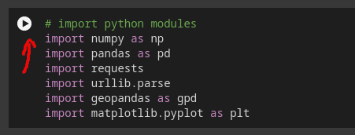

# Geographic Information Systems 2023-2024

# Exercise 13 - Modern GIS

## Introduction

> **GOALS OF THE EXERCISE**
>
> - Obtain a sneak preview of the current advances on GIS
> - Identify trends and determinant technologies

In this exercise, we will try other ways, complementary to the GIS desktop software, 
to perform spatial analysis, in order to get insights on the subject under analysis. 

With the advent of multiple data sources, including open data (e.g. satellite 
imagery, citizen science, data from government and administration, etc), there 
is an increase of data, that are available at different:
- formats:
    - geopackage (gpgk)
    - geojson 
    - shapefile (shp)
    - csv
    - tiff
    - ...
- sources:
    - downloads 
    - webservices Application Programming Interfaces (API)
    - web applications
    - devices (sensors, mobile phones, cameras, Internet of Things (IoT), GPS)

In addition, data gathering, processing and analysis can use multiple technologies, 
computational platforms. Often, the combination of these in a workflow is the 
most efficient way of performing a complex task.

As a result, as a modern GIS practitioner, you need to be prepared to work and 
combine different tools and resources. Often, you will perform part of your work 
using:
- a web portal, to get insight on the data and identification of problems and 
challenges
- for example, Google Earth Engine, which is particularly powerful to facilitate 
access and process raster data
- a scripting or programming tool, for example, a Jupyter Notebook in python, to
perform data processing or analysis
- a web cloud service, like ArcGIS Online to publish your data, and enable 
additional data services.

THis exercise contains three parts:

- Use web applications to consult and analyze spatial data
- Publish data online
- Use code scripts to analyze spatial data

## Part 1. Web applications

*(You should use 30 min for completing this part of the exercise)*

In this part of the exercise, you should visit several web applications, in 
different subjects, in order to identify multiple types of data visualization methods
and data access and use. Click on the links suggested, or browse for more examples.

**ESRI's Living Atlas**

The [ArcGIS Living Atlas](https://livingatlas.arcgis.com/en/home/) is a spatial 
data repository and aggregator of data developed by ESRI and others that 
compiles data on multiple domains. The resources has different visualization 
and analysis tools, including:
- map viewer (online)
- scene viewer (online, for 3D, e.g. [OpenStreetMap 3D Buildings](https://ulisboa.maps.arcgis.com/home/item.html?id=ca0470dbbddb4db28bad74ed39949e25))
- open in ArcGIS (requires an active license of ArcGIS Pro)
- Dashboards (e.g. [Coral Bleaching Locations](https://www.arcgis.com/apps/dashboards/84ba9c03786e462d960e3172bc1b2204))
- blog entries with dynamic data (e.g. [USDA Census of Agriculture updates](https://www.esri.com/arcgis-blog/products/arcgis-living-atlas/mapping/dig-into-2022-ag-census/))
- Web applications (e.g [Sentinel-2 Land Cover Explorer](https://livingatlas.arcgis.com/landcoverexplorer))
- source code (e.g. [Imagery Explorer Apps](https://github.com/Esri/imagery-explorer-apps)),
which you can use to combine with your own code.
- Story maps: [https://storymaps.com](https://storymaps.com)

Please check the examples linked above, or browse to the 
[ArcGIS Living Atlas](https://livingatlas.arcgis.com/en/home/)
and find other examples. Note that most of the data layers can me directly 
accessed from your GIS desktop, and integrated in your GIS projects:
- in **ArcGIS Pro**, online resources are available at the pane **Catalog**, 
tab *Portal*.
- in QGIS 

**Other Web GIS Viewers and data sources**

Some global agencies or programmes of the United Nations (e.g. [UNEP-WCMC](https://resources.unep-wcmc.org/search), [FAO](https://www.fao.org/land-water/databases-and-software/en/)) create and maintain
extensive libraries of spatial data, many of global coverage. These can be 
valuable resources to get background data for our GIS projects.

You will find many online platforms that provide domain specific spatial visualization and 
data access. These are often developed for specific purposes. Some examples:
- Seismological data: [https://www.seismicportal.eu/](https://www.seismicportal.eu/)
- Soil data: [SoilGrids](https://soilgrids.org/)
- Birdwatchers lists data submissions: [https://ebird.org/livesubs](https://ebird.org/livesubs) 
- Cropland Data Layer of the USDA: [CroplandCROS](https://croplandcros.scinet.usda.gov/)
- Map of Life: [https://mol.org/](https://mol.org/)
- Marine regions [https://www.marineregions.org/downloads.php](https://www.marineregions.org/downloads.php)
- Worldclim [https://worldclim.org/](https://worldclim.org/)
- OpenStreetMap (Export): [https://www.openstreetmap.org/export](https://www.openstreetmap.org/export)

## Part 2. Publish data online

*(This is mainly a reading part of the exercise)*

You can publish and share your data and GIS projects online. The platform where 
your data will be available will depend on the desktop software, ArcGIS Pro or QGIS,
you use. In any case, your project, and the individual layers are put online, and 
can be accessed through a URL or database connection.

**ArcGIS Pro**

In the case of ArcGIS Pro, this integrates with ArcGIS Online.

After you finish preparing your GIS project on the desktop app, you can publish 
it online using the menu **Share --> Web map**. For an individual layer, you can 
use the tool **Web layer**. During the publication workflow, you will define the 
visibility of the layer online (public or private), and provide metadata to the 
resource being shared.

The following is an example of our Ex07 project:
[https://ulisboa.maps.arcgis.com/home/item.html?id=767aa067dfc64531bb50aa687c3da595](https://ulisboa.maps.arcgis.com/home/item.html?id=767aa067dfc64531bb50aa687c3da595)

Notice that each of the three vectorial layers integrated in the webmap - roads, 
parcels, boundary - have individual URL, meaning they can be accessed individually.

**QGIS**

The online publication of a GIS project in QGIS is possible using the online service
[QGIS Cloud](https://qgiscloud.com/en/maps). This has several levels of service, 
with the free level allowing to publish and share public maps.

The integration with QGIS Desktop requires the installation of the **QGIS cloud** 
plugin. Using the plugin, it is relatively easy to follow the steps to get the 
project shared online. in addition to the webmap, accessible online, it is 
also possible to create WMS and WFS services for the data layers, for these to 
be integrated in GIS projects. However, the maturity of this service is not the 
best one, because some inconsistencies in data transfer/refresh occur. 

The map for our Ex07 project can be viewed here:
[https://qgiscloud.com/ruifigueira/ex12_cloud](https://qgiscloud.com/ruifigueira/ex12_cloud)

## Part 3. Develop scripts to analyze spatial data

This part of the exercise is to demonstrate how spatial data can be accessed and 
analyzed using python in a Jupyter Notebook. In the analysis, we will determine 
the lnd use / land cover of the ISA's campus we edited on Exercise 07. The 
classification of the area is obtained from the ESA's WorldCover service [https://esa-worldcover.org/en](https://esa-worldcover.org/en).

In order to perform this part of the exercise, you need to open a Jupyter Notebook
hosted at the Google Collaboratory platform. This is a cloud service that provides 
a computing platform for python scripts.

You do not need to know python in order to run the exercise. You need to run in 
sequence, top to bottom, all the code blocks, by clicking on the play button that 
shows when you hover the code you your mouse, as indicated in the image bellow.

To continue to the script code, link to the following: [https://colab.research.google.com/drive/1E5GH_lnp_mjB-SrAcyrT3TR_un1Hcd0r?usp=sharing](https://colab.research.google.com/drive/1E5GH_lnp_mjB-SrAcyrT3TR_un1Hcd0r?usp=sharing) and follow the notebook by reading 
text, running code and analyzing outputs.

